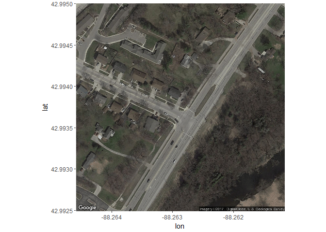
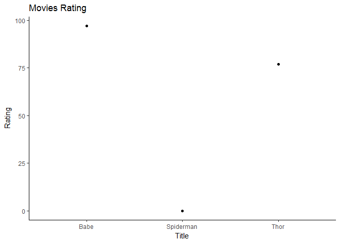

STAT\_547\_HW10
================
iganelin
2017-12-07

HW10
----

#### We start with loading all the necessary general purpose libraries

``` r
library(tidyverse)
library(magrittr)
library(purrr)
library(glue)
library(stringr)
library(purrr)
library(ggmap)
library(knitr)

library(htmltools)
library(htmlwidgets)
```

#### Libraries for web scraping

``` r
library(rvest)
library(xml2)
library(httr)
library(leaflet)
```

#### Working with the [OMDB API](https://www.omdbapi.com)

``` r
get_movie <- function(title, year, key){
    query_string <- glue("http://www.omdbapi.com/?t={title}&y={year}&apikey={key}")
    movie_result <- httr::GET(query_string)
    movie_content <- as.data.frame(content(movie_result))
    return(movie_content)
}
```

#### Start with requesting the information of one of the movies you would like to see. For testing purposes only use your key. you can request it [here](https://www.omdbapi.com/apikey.aspx).

``` r
key <- ""
movie_info <- get_movie("babe", "1995", key)
typeof(movie_info)
```

    ## [1] "list"

``` r
knitr::kable(movie_info)
```

| Title | Year | Rated | Released    | Runtime | Genre                 | Director     | Writer                                                                         | Actors                                                          | Plot                                                                                          | Language | Country        | Awards                                         | Poster                                                                                                                                            | Ratings.Source          | Ratings.Value | Ratings.Source.1 | Ratings.Value.1 | Ratings.Source.2 | Ratings.Value.2 | Metascore | imdbRating | imdbVotes | imdbID    | Type  | DVD         | BoxOffice | Production         | Website | Response |
|:------|:-----|:------|:------------|:--------|:----------------------|:-------------|:-------------------------------------------------------------------------------|:----------------------------------------------------------------|:----------------------------------------------------------------------------------------------|:---------|:---------------|:-----------------------------------------------|:--------------------------------------------------------------------------------------------------------------------------------------------------|:------------------------|:--------------|:-----------------|:----------------|:-----------------|:----------------|:----------|:-----------|:----------|:----------|:------|:------------|:----------|:-------------------|:--------|:---------|
| Babe  | 1995 | G     | 04 Aug 1995 | 91 min  | Comedy, Drama, Family | Chris Noonan | Dick King-Smith (novel), George Miller (screenplay), Chris Noonan (screenplay) | Christine Cavanaugh, Miriam Margolyes, Danny Mann, Hugo Weaving | Babe, a pig raised by sheepdogs, learns to herd sheep with a little help from Farmer Hoggett. | English  | Australia, USA | Won 1 Oscar. Another 18 wins & 23 nominations. | <https://images-na.ssl-images-amazon.com/images/M/MV5BYjg4ZjUzMzMtYzlmYi00YTcwLTlkOWUtYWFmY2RhNjliODQzXkEyXkFqcGdeQXVyNTUyMzE4Mzg@._V1_SX300.jpg> | Internet Movie Database | 6.8/10        | Rotten Tomatoes  | 97%             | Metacritic       | 83/100          | 83        | 6.8        | 101,166   | tt0112431 | movie | 23 Sep 2003 | N/A       | Universal Pictures | N/A     | True     |

``` r
#View(movie_info)
```

#### Plot the Movies locatoin using simple ggmap.

``` r
ggmap_movie_location <- function(movie_info){
    countries <- str_split(movie_info$Country, ",")
    loc <- geocode(as.character(countries))
    map_in <- get_map(location = c(lon = loc$lon, lat = loc$lat), zoom = 18, scale = "auto", maptype = "satellite")
    map_out <- ggmap(map_in)+geom_point(aes_string(x=loc$lat, y=loc$lon), colour = "red")
}
map <- ggmap_movie_location(movie_info)
```

    ## Information from URL : http://maps.googleapis.com/maps/api/geocode/json?address=c(%22Australia%22,%20%22%20USA%22)&sensor=false

    ## Map from URL : http://maps.googleapis.com/maps/api/staticmap?center=42.993749,-88.262879&zoom=18&size=640x640&scale=2&maptype=satellite&language=en-EN&sensor=false

``` r
map
```

    ## Warning: Removed 4 rows containing missing values (geom_point).



#### Plot the Movie's of interest Location using ggmap and leaflet. Leaflet is better for html or shiny apps display of the data.

``` r
get_movie_location <- function(movie_info){
    countries <- str_split(movie_info$Country, ",")
    loc <- geocode(as.character(countries))
    m <- leaflet() %>%
        addTiles() %>%  # Add default OpenStreetMap map tiles
        addMarkers(lng=loc$lon, lat=loc$lat, popup="Movie Location")
    return(m)
}

map <- get_movie_location(movie_info)
```

    ## Information from URL : http://maps.googleapis.com/maps/api/geocode/json?address=c(%22Australia%22,%20%22%20USA%22)&sensor=false

``` r
leaflet(map)
```

<!--html_preserve-->

<script type="application/json" data-for="htmlwidget-27a6b91786c2c55e0acc">{"x":{"options":{"crs":{"crsClass":"L.CRS.EPSG3857","code":null,"proj4def":null,"projectedBounds":null,"options":{}}}},"evals":[],"jsHooks":[]}</script>
<!--/html_preserve-->
``` r
map
```

<!--html_preserve-->

<script type="application/json" data-for="htmlwidget-8296b26bc4c84eb09122">{"x":{"options":{"crs":{"crsClass":"L.CRS.EPSG3857","code":null,"proj4def":null,"projectedBounds":null,"options":{}}},"calls":[{"method":"addTiles","args":["//{s}.tile.openstreetmap.org/{z}/{x}/{y}.png",null,null,{"minZoom":0,"maxZoom":18,"maxNativeZoom":null,"tileSize":256,"subdomains":"abc","errorTileUrl":"","tms":false,"continuousWorld":false,"noWrap":false,"zoomOffset":0,"zoomReverse":false,"opacity":1,"zIndex":null,"unloadInvisibleTiles":null,"updateWhenIdle":null,"detectRetina":false,"reuseTiles":false,"attribution":"&copy; <a href=\"http://openstreetmap.org\">OpenStreetMap<\/a> contributors, <a href=\"http://creativecommons.org/licenses/by-sa/2.0/\">CC-BY-SA<\/a>"}]},{"method":"addMarkers","args":[42.9937489,-88.2628786,null,null,null,{"clickable":true,"draggable":false,"keyboard":true,"title":"","alt":"","zIndexOffset":0,"opacity":1,"riseOnHover":false,"riseOffset":250},"Movie Location",null,null,null,null,null,null]}],"limits":{"lat":[42.9937489,42.9937489],"lng":[-88.2628786,-88.2628786]}},"evals":[],"jsHooks":[]}</script>
<!--/html_preserve-->
#### Expand our function to output multiple

``` r
get_movies <- function(title, key){
    for (i in 1:length(movies_list)){
        if (i == 1){
            query_string <- glue("http://www.omdbapi.com/?t={movies_list[i]}&apikey={key}")
            movie_result <- httr::GET(query_string)
            movie_content <- as.data.frame(content(movie_result))
        }
        else{
            query_string <- glue("http://www.omdbapi.com/?t={movies_list[i]}&apikey={key}")
            movie_result <- httr::GET(query_string)
            movie_content <- full_join(movie_content, as.data.frame(content(movie_result)), by = colnames(as.data.frame(content(movie_result))))
        }
    }
    return(movie_content)
}
```

#### Let's see the result.

We start with creating a list of the movies we would like to download info for. \#include=FALSE}

``` r
key <- ""
movies_list <- c("babe", "thor", "spiderman")
movies <- get_movies(movies_list, key)
```


``` r
#View(movies)
knitr::kable(movies)
```

| Title        | Year    | Rated   | Released       | Runtime   | Genre                         | Director         | Writer                                                                                                                                                                                                            | Actors                                                            | Plot                                                                                                                                                       | Language | Country        | Awards                                         | Poster                                                                                                                                            | Ratings.Source          | Ratings.Value | Ratings.Source.1 | Ratings.Value.1 | Ratings.Source.2 | Ratings.Value.2 | Metascore | imdbRating | imdbVotes | imdbID    | Type  | DVD         | BoxOffice    | Production         | Website                   | Response |
|:-------------|:--------|:--------|:---------------|:----------|:------------------------------|:-----------------|:------------------------------------------------------------------------------------------------------------------------------------------------------------------------------------------------------------------|:------------------------------------------------------------------|:-----------------------------------------------------------------------------------------------------------------------------------------------------------|:---------|:---------------|:-----------------------------------------------|:--------------------------------------------------------------------------------------------------------------------------------------------------|:------------------------|:--------------|:-----------------|:----------------|:-----------------|:----------------|:----------|:-----------|:----------|:----------|:------|:------------|:-------------|:-------------------|:--------------------------|:---------|
| Babe         | 1995    | G       | 04 Aug 1995    | 91 min    | Comedy, Drama, Family         | Chris Noonan     | Dick King-Smith (novel), George Miller (screenplay), Chris Noonan (screenplay)                                                                                                                                    | Christine Cavanaugh, Miriam Margolyes, Danny Mann, Hugo Weaving   | Babe, a pig raised by sheepdogs, learns to herd sheep with a little help from Farmer Hoggett.                                                              | English  | Australia, USA | Won 1 Oscar. Another 18 wins & 23 nominations. | <https://images-na.ssl-images-amazon.com/images/M/MV5BYjg4ZjUzMzMtYzlmYi00YTcwLTlkOWUtYWFmY2RhNjliODQzXkEyXkFqcGdeQXVyNTUyMzE4Mzg@._V1_SX300.jpg> | Internet Movie Database | 6.8/10        | Rotten Tomatoes  | 97%             | Metacritic       | 83/100          | 83        | 6.8        | 101,166   | tt0112431 | movie | 23 Sep 2003 | N/A          | Universal Pictures | N/A                       | True     |
| Thor         | 2011    | PG-13   | 06 May 2011    | 115 min   | Action, Adventure, Fantasy    | Kenneth Branagh  | Ashley Miller (screenplay), Zack Stentz (screenplay), Don Payne (screenplay), J. Michael Straczynski (story), Mark Protosevich (story), Stan Lee (comic book), Larry Lieber (comic book), Jack Kirby (comic book) | Chris Hemsworth, Natalie Portman, Tom Hiddleston, Anthony Hopkins | The powerful, but arrogant god Thor, is cast out of Asgard to live amongst humans in Midgard (Earth), where he soon becomes one of their finest defenders. | English  | USA            | 5 wins & 30 nominations.                       | <https://images-na.ssl-images-amazon.com/images/M/MV5BOGE4NzU1YTAtNzA3Mi00ZTA2LTg2YmYtMDJmMThiMjlkYjg2XkEyXkFqcGdeQXVyNTgzMDMzMTg@._V1_SX300.jpg> | Internet Movie Database | 7.0/10        | Rotten Tomatoes  | 77%             | Metacritic       | 57/100          | 57        | 7.0        | 595,062   | tt0800369 | movie | 13 Sep 2011 | $181,015,141 | Paramount Pictures | <http://thor.marvel.com/> | True     |
| Spiderman    | 1990    | N/A     | N/A            | 5 min     | Short                         | Christian Davi   | N/A                                                                                                                                                                                                               | N/A                                                               | N/A                                                                                                                                                        | German   | Switzerland    | N/A                                            | N/A                                                                                                                                               | Internet Movie Database | 5.7/10        | NA               | NA              | NA               | NA              | N/A       | 5.7        | 90        | tt0100669 | movie | N/A         | N/A          | N/A                | N/A                       | True     |
| So now we ca | n downl | oad the | movie info and | save it i | nto the dataframe that we can | use later in the | project.                                                                                                                                                                                                          |                                                                   |                                                                                                                                                            |          |                |                                                |                                                                                                                                                   |                         |               |                  |                 |                  |                 |           |            |           |           |       |             |              |                    |                           |          |

#### We can plot the rating of the movies that we extracted.

``` r
plot_rating <- function(movies){
    r1 <- str_split(movies$Ratings.Value.1, " ")
    r2 <- str_replace(r1, "%", "")
    Rating <- as.integer(r2)
    Rating[is.na(Rating)] <- 0
    
    movies %>%
        mutate(rating = Rating) %>% 
        ggplot(aes(x = Title, y = Rating), colour=Title) +
        ggtitle("Movies Rating") +
        theme_classic() +
        geom_point()
}

plot_rating(movies)
```



#### This is a current weather request at the location of the movie. Use your key from [here](https://openweathermap.org/api).

The functions reads the data frame that we aquired earlier from the movie data set, then it calls the weather API and gets the current weather report for that location. Easy, but powerful!

``` r
current_weather <- function(movie_info, key){
    countries <- str_split(movie_info$Country, ",")
    loc <- geocode(as.character(countries))
    lat <- loc$lat
    lon <- loc$lon
    query_string <- glue("api.openweathermap.org/data/2.5/weather?lat={lat}&lon={lon}&appid={key}")
    weather_result <- httr::GET(query_string)
    weather_content <- content(weather_result)
    movie_content <- as.data.frame(weather_content$weather)
    return(movie_content)
}
weather_api_key <- ""
weather <- current_weather(movie_info, weather_api_key)
#View(weather)
knitr::kable(weather)
```

|   id| main  | description | icon |
|----:|:------|:------------|:-----|
|  800| Clear | clear sky   | 01d  |

##### Start with requesting the information of one of the movies you would like to see from [here](https://www.theimdbapi.org/).

### Following functions currently do not work, as I am waiting for the API key approval:

#### Download the movie information from another [source](https://www.theimdbapi.org/)

``` r
get_movie2 <- function(title, year){
    query_string <- glue("http://www.theimdbapi.org/api/find/movie?title={title}&year={year}")
    movie_result <- httr::GET(query_string)
    movie_content <- as.data.frame(content(movie_result)[[1]])
    return(movie_content)
}
```

#### Download the movie information from yet another [source](https://www.themoviedb.org)

``` r
get_movie3 <- function(title, year, key){
    query_string <- glue("https://api.themoviedb.org/3/movie/550?api_key={key}")
    movie_result <- httr::GET(query_string)
    movie_content <- as.data.frame(content(movie_result))
    return(movie_content)
}
```
