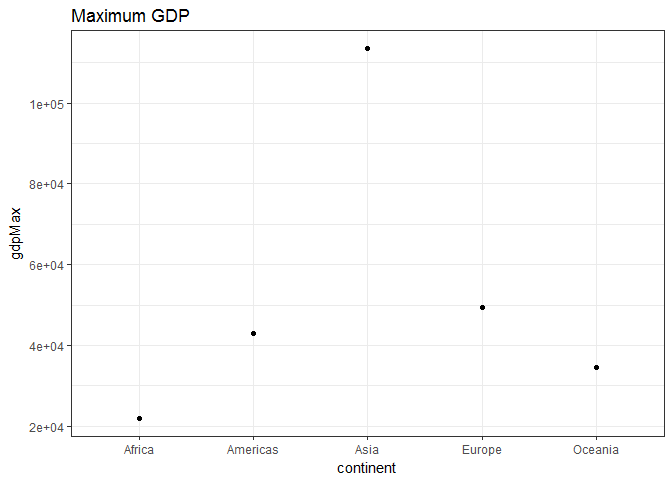
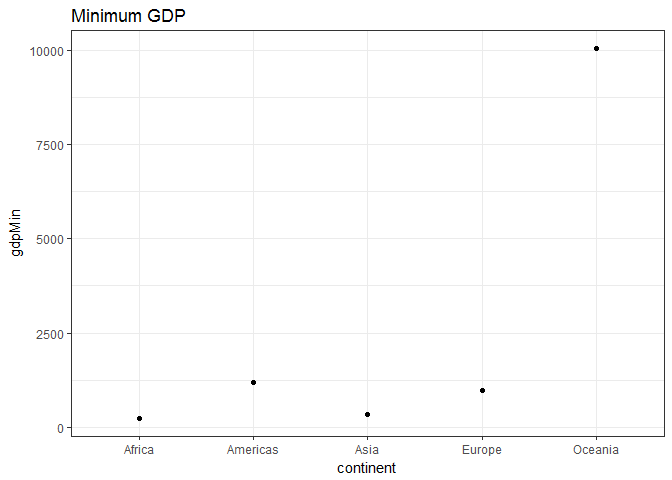
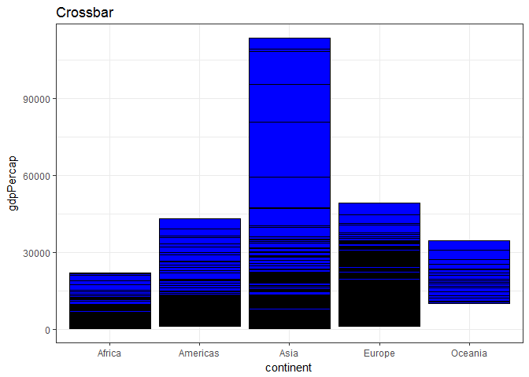
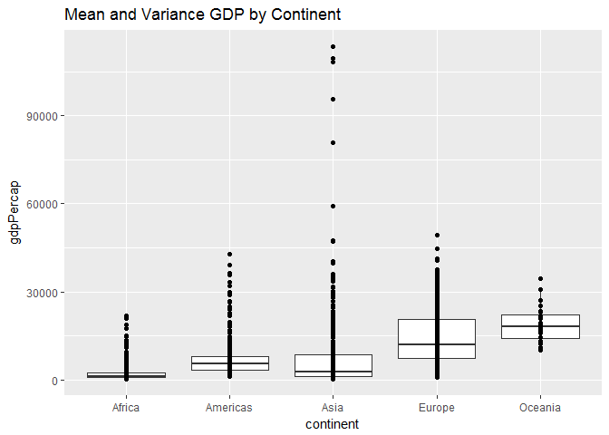
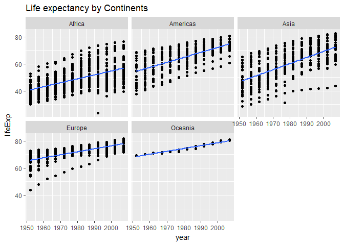

hw03\_dplyr-and-more-ggplot2s
================
September 26, 2017

``` r
library(tidyverse)
```

    ## Loading tidyverse: ggplot2
    ## Loading tidyverse: tibble
    ## Loading tidyverse: tidyr
    ## Loading tidyverse: readr
    ## Loading tidyverse: purrr
    ## Loading tidyverse: dplyr

    ## Conflicts with tidy packages ----------------------------------------------

    ## filter(): dplyr, stats
    ## lag():    dplyr, stats

``` r
library(gapminder)
library(dplyr)
library(ggplot2)
library(knitr)
library(dplyr)
```

Tasks
=====

### Get the maximum and minimum of GDP per capita for all continents.

``` r
gapminder %>% 
  group_by(continent) %>% 
  mutate(gdpMin = min(gdpPercap), gdpMax = max(gdpPercap)) %>% 
  head() %>% 
  kable(., format = "markdown", caption = "Maximum and minimum of GDP per capita for all continents")
```

| country     | continent |  year|  lifeExp|       pop|  gdpPercap|  gdpMin|    gdpMax|
|:------------|:----------|-----:|--------:|---------:|----------:|-------:|---------:|
| Afghanistan | Asia      |  1952|   28.801|   8425333|   779.4453|     331|  113523.1|
| Afghanistan | Asia      |  1957|   30.332|   9240934|   820.8530|     331|  113523.1|
| Afghanistan | Asia      |  1962|   31.997|  10267083|   853.1007|     331|  113523.1|
| Afghanistan | Asia      |  1967|   34.020|  11537966|   836.1971|     331|  113523.1|
| Afghanistan | Asia      |  1972|   36.088|  13079460|   739.9811|     331|  113523.1|
| Afghanistan | Asia      |  1977|   38.438|  14880372|   786.1134|     331|  113523.1|

-   First Table: I created additional columns named gdpMax and gdpMin on the original data frame grouped by continent.

``` r
gapminder %>%
    group_by(continent) %>% 
    summarize(gdpMinK = min(gdpPercap),
              gdpMaxK = max(gdpPercap))
```

    ## # A tibble: 5 x 3
    ##   continent    gdpMinK   gdpMaxK
    ##      <fctr>      <dbl>     <dbl>
    ## 1    Africa   241.1659  21951.21
    ## 2  Americas  1201.6372  42951.65
    ## 3      Asia   331.0000 113523.13
    ## 4    Europe   973.5332  49357.19
    ## 5   Oceania 10039.5956  34435.37

-   Second Table: The table with the summary by continent.

``` r
mn <- gapminder %>% 
  group_by(continent) %>% 
  mutate( gdpMin = min(gdpPercap), gdpMax = max(gdpPercap))

  ggplot(mn, aes(continent,gdpMax), colour=country) +
  geom_point() +
  theme_bw() +
  ggtitle("Maximum GDP")
```



``` r
  ggplot(mn, aes(continent,gdpMin), colour=country) +
  geom_point() +
  theme_bw() +
  ggtitle("Minimum GDP")
```



``` r
  ggplot(mn) +
  geom_crossbar(aes(ymin = gdpMin, ymax = gdpMax, x = continent, y = gdpPercap), fill = "blue",   fatten = 0) +
  theme_bw() +
  ggtitle("Crossbar")
```



-   Two graphs displaying minimum and maximum values. Did some research on how to add the title to the graph.
-   Crossbar graph showing min and Max. Played a bit with the fatten values and the colors.

### Look at the spread of GDP per capita within the continents.

``` r
gapminder %>% 
  group_by(continent) %>% 
  mutate(gdpVar = var(gdpPercap), gdpMean = mean(gdpPercap)) %>% 
  head() %>% 
  kable(., format = "markdown", caption = "Spread of GDP per capita within the continents")
```

| country     | continent |  year|  lifeExp|       pop|  gdpPercap|     gdpVar|  gdpMean|
|:------------|:----------|-----:|--------:|---------:|----------:|----------:|--------:|
| Afghanistan | Asia      |  1952|   28.801|   8425333|   779.4453|  197272506|  7902.15|
| Afghanistan | Asia      |  1957|   30.332|   9240934|   820.8530|  197272506|  7902.15|
| Afghanistan | Asia      |  1962|   31.997|  10267083|   853.1007|  197272506|  7902.15|
| Afghanistan | Asia      |  1967|   34.020|  11537966|   836.1971|  197272506|  7902.15|
| Afghanistan | Asia      |  1972|   36.088|  13079460|   739.9811|  197272506|  7902.15|
| Afghanistan | Asia      |  1977|   38.438|  14880372|   786.1134|  197272506|  7902.15|

-   First Table: I created additional columns named gdpMean and gdpVar on the original data frame grouped by continent. Print its head as kable just to see if it looks fine.

``` r
gapminder %>%
    group_by(continent) %>% 
    summarize(gdpVarK = var(gdpPercap),
              gdpMeanK = mean(gdpPercap))
```

    ## # A tibble: 5 x 3
    ##   continent   gdpVarK  gdpMeanK
    ##      <fctr>     <dbl>     <dbl>
    ## 1    Africa   7997187  2193.755
    ## 2  Americas  40918591  7136.110
    ## 3      Asia 197272506  7902.150
    ## 4    Europe  87520020 14469.476
    ## 5   Oceania  40436669 18621.609

-   Second Table: The table with the summary by continent. Very nice summary tibble, will definnitely integrate it into teh future workflow.

``` r
mn <- gapminder %>% 
  mutate(gdpVar = var(gdpPercap), gdpMean = mean(gdpPercap))  %>% 
  ggplot(aes(continent,gdpPercap)) + 
  geom_boxplot()
mn + geom_point() +
  ggtitle("Mean and Variance GDP by Continent")
```



-   Nice box plot, but I am not sure if the variance is displayed correctly. I played with the parameters, but will have to research it a bit more in the future.

### How is life expectancy changing over time on different continents?

``` r
gapminder %>% 
  arrange(continent) %>% 
  head() %>% 
  kable(., format = "markdown", caption = "Life expectancy by Continents")
```

| country | continent |  year|  lifeExp|       pop|  gdpPercap|
|:--------|:----------|-----:|--------:|---------:|----------:|
| Algeria | Africa    |  1952|   43.077|   9279525|   2449.008|
| Algeria | Africa    |  1957|   45.685|  10270856|   3013.976|
| Algeria | Africa    |  1962|   48.303|  11000948|   2550.817|
| Algeria | Africa    |  1967|   51.407|  12760499|   3246.992|
| Algeria | Africa    |  1972|   54.518|  14760787|   4182.664|
| Algeria | Africa    |  1977|   58.014|  17152804|   4910.417|

``` r
gapminder %>% 
    ggplot(aes(year,lifeExp)) +
  facet_wrap(~ continent) +
  geom_point() +
  geom_smooth(method="lm", se=FALSE) +
  ggtitle("Life expectancy by Continents")
```



-   From the graph we can see that the life expectancy grows on all the continents, but with different rate.

### Remaining Questions

-   Compute a trimmed mean of life expectancy for different years. Or a weighted mean, weighting by population. Just try something other than the plain vanilla mean.

-   Report the absolute and/or relative abundance of countries with low life expectancy over time by continent: Compute some measure of worldwide life expectancy – you decide – a mean or median or some other quantile or perhaps your current age. Then determine how many countries on each continent have a life expectancy less than this benchmark, for each year.

-   Find countries with interesting stories. Open-ended and, therefore, hard. Promising but unsuccessful attempts are encouraged. This will generate interesting questions to follow up on in class.

-   Make up your own! Between the dplyr coverage in class and the list above, I think you get the idea.

### Report your process

-   A few web searches were required in order to find appropriate functionality for ggplot. I used the RStudio forums and stackoverflow.
-   Three tables + three graphs are ready. Will add more if time permits.

*Thank you :)*
