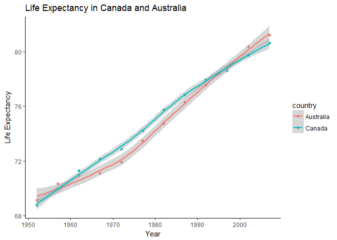

HW4
================
iganelin
October 8, 2017

Homework 4
==========

### Loading libraries

``` r
library(gapminder)
library(tidyverse)
library(knitr)
library(dplyr)
```

Data Reshaping
==============

Activity \#1: Minimal guide to tidyr
------------------------------------

This is a minimal guide, mostly for myself, to remind me of the most import tidyr functions **gather** and **spread** functions that I'm familiar with. Also check out [A tidyr Tutorial](http://data.library.virginia.edu/a-tidyr-tutorial/).

Start with installing the package using following commands **install.packages("tidyverse")** or **install.packages("tidyr")**.

We will be using the **gapminder** data as our input. - Firstly, let's create a data frame to manipulate with:

``` r
dp <- gapminder %>%
  group_by(continent) %>% 
  summarize(mean_gdpPercap = mean(gdpPercap),
              n_countries    = length(gdpPercap))

continents <- data.frame(
   continent = dp$continent,
   meanGdp   = dp$mean_gdpPercap,
   n_countries = dp$n_countries)
continents 
```

    ##   continent   meanGdp n_countries
    ## 1    Africa  2193.755         624
    ## 2  Americas  7136.110         300
    ## 3      Asia  7902.150         396
    ## 4    Europe 14469.476         360
    ## 5   Oceania 18621.609          24

-   The help page for gather says that it “takes multiple columns and collapses into key-value pairs, duplicating all other columns as needed”

``` r
continentsG <- gather(data = continents, key = continent, value = meanGdp)
continentsG
```

    ##   continent   meanGdp   continent meanGdp
    ## 1    Africa  2193.755 n_countries     624
    ## 2  Americas  7136.110 n_countries     300
    ## 3      Asia  7902.150 n_countries     396
    ## 4    Europe 14469.476 n_countries     360
    ## 5   Oceania 18621.609 n_countries      24

...or as we call it "melting data".

A picture is worth a thousand words!


Activity \#2: Make a tibble with one row per year and columns for life expectancy for two or more countries.
------------------------------------------------------------------------------------------------------------

-   A tibble with *year* as a measure, *gdpPercap* as a value for Canada and Australia.

``` r
leTbl <- select(filter(gapminder, country %in% c("Canada", "Australia")),
      year, country, lifeExp) %>% 
      gather(measure, value, lifeExp) %>% 
      arrange(country, year)
#kable(leTbl, format = "markdown", caption = "Life Expectancy in Canada and Australia")

head(knitr::kable(leTbl))
```

    ## [1] " year  country     measure     value"
    ## [2] "-----  ----------  --------  -------"
    ## [3] " 1952  Australia   lifeExp    69.120"
    ## [4] " 1957  Australia   lifeExp    70.330"
    ## [5] " 1962  Australia   lifeExp    70.930"
    ## [6] " 1967  Australia   lifeExp    71.100"

-   A scatterplot of life expectancy for Canada against Australia.

``` r
ggplot(leTbl, aes(x=year, y=value, colour=country))+
  geom_point() +
  geom_smooth() +
  scale_x_continuous("Year") +
  scale_y_continuous("Life Expectancy") +
  labs(title = "Life Expectancy in Canada and Australia") +
  theme_classic() +
  theme(legend.position = "bottom")
```

    ## `geom_smooth()` using method = 'loess'



-   We can see from the scatterplot that from 1958 and until 1999 the life expectancy in Canada was higher.

Activity \#3
------------

-   Compute some measure of life expectancy for all possible combinations of continent and year.

``` r
td.gapminder <- gapminder %>% 
  select (-c(country, pop, gdpPercap)) %>% 
  group_by(continent) %>% 
  mutate(meanLifeExp=mean(lifeExp)) %>% 
  gather(measure, value, lifeExp)
#knitr::kable(td.gapminder) # Just too long of the output
head(knitr::kable(td.gapminder))
```

    ## [1] "continent    year   meanLifeExp  measure       value"
    ## [2] "----------  -----  ------------  --------  ---------"
    ## [3] "Asia         1952      60.06490  lifeExp    28.80100"
    ## [4] "Asia         1957      60.06490  lifeExp    30.33200"
    ## [5] "Asia         1962      60.06490  lifeExp    31.99700"
    ## [6] "Asia         1967      60.06490  lifeExp    34.02000"

-   The table summarizes the life expectancy per year per continent

Join Prompt: Join, Merge, Look up
=================================

Activity \#1
------------

-   Create a second data frame, complementary to Gapminder. Join this with (part of) Gapminder using a *dplyr* join function and make some observations about the process and result. Explore the different types of joins.

**Dataframe:** One row per country, a country variable and one or more variables with extra info, such as language spoken, NATO membership, national animal, or capitol city. If you really want to be helpful, you could attempt to make a pull request to resolve this issue, where I would like to bring ISO country codes into the gapminder package.

-   I am going to use WDI climate data set. We start with grabbing GNI per capita data for Chile, Hungary, Uruguay, Mexico, Canada, and USA for years 1952 - 2017.

``` r
library(WDI)
```

    ## Loading required package: RJSONIO

``` r
td.wdi <- WDI(indicator='NY.GDP.PCAP.KD', country=c('MX','CA','US','CL','HU','UY'), start=1952, end=2017) %>% 
  select(-iso2c)
head(knitr::kable(td.wdi))
```

    ## [1] "country          NY.GDP.PCAP.KD   year"
    ## [2] "--------------  ---------------  -----"
    ## [3] "Canada                50231.885   2016"
    ## [4] "Canada                50109.875   2015"
    ## [5] "Canada                50067.043   2014"
    ## [6] "Canada                49355.097   2013"

``` r
#or
#View(td.wdi)

td.gapminder <- gapminder %>% 
  select (-c(pop, gdpPercap)) %>% 
  group_by(continent) %>% 
  mutate(meanLifeExp=mean(lifeExp)) %>% 
  gather(measure, value, lifeExp)

head(knitr::kable(td.gapminder))
```

    ## [1] "country                    continent    year   meanLifeExp  measure       value"
    ## [2] "-------------------------  ----------  -----  ------------  --------  ---------"
    ## [3] "Afghanistan                Asia         1952      60.06490  lifeExp    28.80100"
    ## [4] "Afghanistan                Asia         1957      60.06490  lifeExp    30.33200"
    ## [5] "Afghanistan                Asia         1962      60.06490  lifeExp    31.99700"
    ## [6] "Afghanistan                Asia         1967      60.06490  lifeExp    34.02000"

-   Inner Join.

*Note: the countries that are not in our previously mentioned list in WDI will have NA instead of the values.*

``` r
td.ij <- inner_join(td.gapminder,td.wdi,by="country")
```

    ## Warning: Column `country` joining factor and character vector, coercing
    ## into character vector

``` r
head(knitr::kable(td.ij))
```

    ## [1] "country         continent    year.x   meanLifeExp  measure     value   NY.GDP.PCAP.KD   year.y"
    ## [2] "--------------  ----------  -------  ------------  --------  -------  ---------------  -------"
    ## [3] "Canada          Americas       1952      64.65874  lifeExp    68.750        50231.885     2016"
    ## [4] "Canada          Americas       1952      64.65874  lifeExp    68.750        50109.875     2015"
    ## [5] "Canada          Americas       1952      64.65874  lifeExp    68.750        50067.043     2014"
    ## [6] "Canada          Americas       1952      64.65874  lifeExp    68.750        49355.097     2013"

The join result has all variables from td.gapminder plus NY.GDP.PCAP.KD, from td.wdi.

-   Full Join

``` r
td.ij <- full_join(td.gapminder,td.wdi)
```

    ## Joining, by = c("country", "year")

    ## Warning: Column `country` joining factor and character vector, coercing
    ## into character vector

``` r
head(knitr::kable(td.ij))
```

    ## [1] "country                    continent    year   meanLifeExp  measure       value   NY.GDP.PCAP.KD"
    ## [2] "-------------------------  ----------  -----  ------------  --------  ---------  ---------------"
    ## [3] "Afghanistan                Asia         1952      60.06490  lifeExp    28.80100               NA"
    ## [4] "Afghanistan                Asia         1957      60.06490  lifeExp    30.33200               NA"
    ## [5] "Afghanistan                Asia         1962      60.06490  lifeExp    31.99700               NA"
    ## [6] "Afghanistan                Asia         1967      60.06490  lifeExp    34.02000               NA"

Here we used full join and kept all the information from both data bases. Note that we joined by both "country" and "year".

Activity \#2: Create cheatsheet patterned.
------------------------------------------
