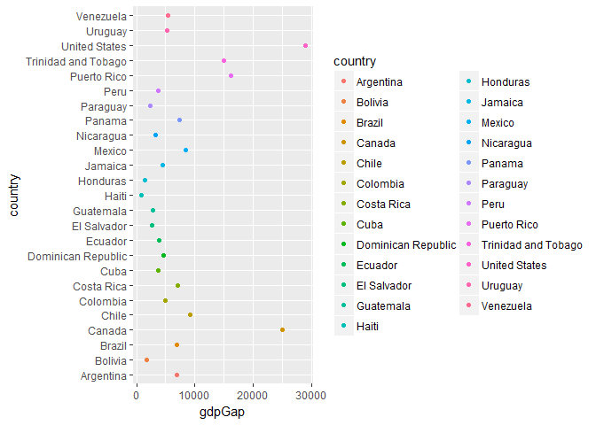
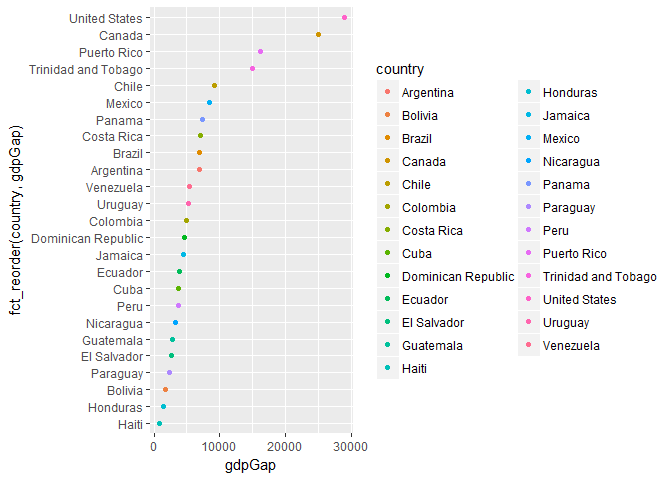

HW5
================
iganelin
October 13, 2017

Homework 5
==========

### Loading libraries

``` r
library(gapminder)
library(singer)
library(tidyverse)
library(knitr)
library(dplyr)
library(forcats)
```

Gapminder version:
------------------

``` r
str(gapminder$continent)
```

    ##  Factor w/ 5 levels "Africa","Americas",..: 3 3 3 3 3 3 3 3 3 3 ...

``` r
fct_count(gapminder$continent)
```

    ## # A tibble: 5 x 2
    ##          f     n
    ##     <fctr> <int>
    ## 1   Africa   624
    ## 2 Americas   300
    ## 3     Asia   396
    ## 4   Europe   360
    ## 5  Oceania    24

So we know that continent in Gapminder is a factor variable and there are 24 entries of Oceania.

#### Drop Oceania. Filter the Gapminder data to remove observations associated with the continent of Oceania.

``` r
h_continents <- c("Oceania")
h_gap <- gapminder %>%
  filter(continent != h_continents)
nlevels(h_gap$continent)
```

    ## [1] 5

``` r
head(knitr::kable(h_gap))
```

    ## [1] "country                    continent    year    lifeExp          pop     gdpPercap"
    ## [2] "-------------------------  ----------  -----  ---------  -----------  ------------"
    ## [3] "Afghanistan                Asia         1952   28.80100      8425333      779.4453"
    ## [4] "Afghanistan                Asia         1957   30.33200      9240934      820.8530"
    ## [5] "Afghanistan                Asia         1962   31.99700     10267083      853.1007"
    ## [6] "Afghanistan                Asia         1967   34.02000     11537966      836.1971"

I used the list, for future extension. It can be done with just one line.

#### Additionally, remove unused factor levels. Provide concrete information on the data before and after removing these rows and Oceania; address the number of rows and the levels of the affected factors.

``` r
levels_before <- nlevels(h_gap$continent)
levels_before
```

    ## [1] 5

The number of levels **before** dropping the unused factor levels.

``` r
h_gap_dropped <- h_gap %>% 
  droplevels()

levels_after <- nlevels(h_gap_dropped$continent)
levels_after
```

    ## [1] 4

The number of levels **after** dropping the unused factor levels.

Reorder the levels of country or continent. Use the forcats package to change the order of the factor levels, based on a principled summary of one of the quantitative variables. Consider experimenting with a summary statistic beyond the most basic choice of the median.

``` r
h_gap_dropped_reorder <- fct_reorder(h_gap_dropped$continent, h_gap_dropped$lifeExp) %>% 
  levels() %>% head()
h_gap_dropped_reorder
```

    ## [1] "Africa"   "Asia"     "Americas" "Europe"

``` r
h_gap_dropped_reorder <- fct_reorder(h_gap_dropped$continent, h_gap_dropped$lifeExp,  .desc = TRUE) %>% 
  levels() %>% head()
h_gap_dropped_reorder
```

    ## [1] "Europe"   "Americas" "Asia"     "Africa"

``` r
h_gap_dropped_add <- h_gap_dropped %>% 
  mutate(maxLifeExp = max(lifeExp), minLifeExp = min(lifeExp)) %>% 
  mutate(ageGap = maxLifeExp-minLifeExp)

h_gap_dropped_reorder <- fct_reorder(h_gap_dropped_add$country, h_gap_dropped_add$ageGap) %>% 
  levels() %>% head()
h_gap_dropped_reorder
```

    ## [1] "Afghanistan" "Albania"     "Algeria"     "Angola"      "Argentina"  
    ## [6] "Austria"

``` r
h_gap_dropped_add <- h_gap_dropped %>% 
  group_by(country) %>% 
  mutate(gdpGap = max(gdpPercap)-min(gdpPercap))

h_gap_dropped_reorder <- fct_reorder(h_gap_dropped_add$country, h_gap_dropped_add$gdpGap) %>% 
  levels() %>% head()
h_gap_dropped_reorder
```

    ## [1] "Burundi"     "Ethiopia"    "Afghanistan" "Senegal"     "Rwanda"     
    ## [6] "Liberia"

``` r
gdpGap <- h_gap_dropped_add %>% filter(year == 2007, continent == "Americas")
ggplot(gdpGap, aes(x = gdpGap, y = country, color = country)) +
  geom_point()
```



``` r
ggplot(gdpGap, aes(x = gdpGap, y = fct_reorder(country, gdpGap), color = country)) +
  geom_point()
```


-   The graphs to show the usability of factors.

##### In my reordering excersice

-   Reordered the continent factors based on the gaps in life expectancy values.
-   Reordered the continent factors based on the gaps in gdp per capita values.

#### Common part:

While you’re here, practice writing to file and reading back in (see next section).

Characterize the (derived) data before and after your factor re-leveling.

-   Explore the effects of arrange(). Does merely arranging the data have any effect on, say, a figure?
-   Explore the effects of reordering a factor and factor reordering coupled with arrange(). Especially, what effect does this have on a figure?

``` r
h_gap_dropped_add %>% 
  filter(year == 2007, continent == "Americas") %>% 
  arrange(lifeExp) %>% 
  ggplot(aes(x = gdpGap, y = fct_reorder(country, gdpGap), color = country)) +
  geom_point()
```



-   "Arrange" function did not play role in the example above.

``` r
h_gap_dropped_add %>% 
  filter(year == 2007, continent == "Americas") %>% 
  arrange(country) %>% 
  ggplot(aes(x = gdpGap, y = fct_reorder(country, gdpGap), color = country)) +
  geom_point()
```


File I/O
--------

Experiment with one or more of write\_csv()/read\_csv() (and/or TSV friends), saveRDS()/readRDS(), dput()/dget(). Create something new, probably by filtering or grouped-summarization of Singer or Gapminder. I highly recommend you fiddle with the factor levels, i.e. make them non-alphabetical (see previous section). Explore whether this survives the round trip of writing to file then reading back in. Visualization design

Remake at least one figure or create a new one, in light of something you learned in the recent class meetings about visualization design and color. Maybe juxtapose your first attempt and what you obtained after some time spent working on it. Reflect on the differences. If using Gapminder, you can use the country or continent color scheme that ships with Gapminder. Consult the guest lecture from Tamara Munzner and everything here. Writing figures to file

Use ggsave() to explicitly save a plot to file. Then use ! to load and embed it in your report. You can play around with various options, such as:

-   Arguments of ggsave(), such as width, height, resolution or text scaling.
-   Various graphics devices, e.g. a vector vs. raster format.
-   Explicit provision of the plot object p via ggsave(..., plot = p). Show a situation in which this actually matters.

-   We will start with reading teh file from our system and saving into gap\_tsv.

-   Write into csv file.

``` r
write_csv(my_gapminder, "gap_life_exp.csv")
```
