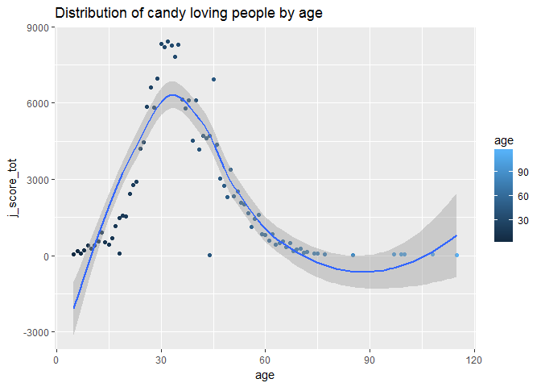
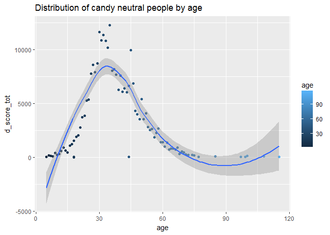

HW6
================
iganelin
2017-11-10

Homework 06: Data wrangling wrap up (Due date 10/11/17)
=======================================================

### Loading libraries

``` r
library(gapminder)
library(singer)
library(tidyverse)
library(knitr)
library(forcats)
library(magrittr)
#library(plyr)
library(dplyr)
library(meme)
library(readr)
library(tidyr)
library(stringr)
library(ggplot2)
```

``` r
u <- "http://i0.kym-cdn.com/entries/icons/mobile/000/000/745/success.jpg"
#meme(u, "Homework 6", "Yes! Give me more!")
mmplot(u) + mm_caption("Homework 6", "Yes! Give me more!", color="purple")
```


1. Character data
-----------------

We wil start from the loading the libraries for this excercise.

``` r
library(tidyverse)
library(stringr)
```

Lets write a few strings.

``` r
string1 <- "This is definitely string"
string2 <- 'If I want to include a "quote" inside a string, I use single quotes'
str_c("x", "y", "z")
```

    ## [1] "xyz"

``` r
str_c(string1, ". ", string2)
```

    ## [1] "This is definitely string. If I want to include a \"quote\" inside a string, I use single quotes"

``` r
#or
str_c(string1, string2, sep = ", ")
```

    ## [1] "This is definitely string, If I want to include a \"quote\" inside a string, I use single quotes"

### Character Data

#### 14.2.5 Exercises

1.  In code that doesn’t use stringr, you’ll often see paste() and paste0(). What’s the difference between the two functions?

The difference between paste() and paste0() is that the argument "sep"" by default is ” ” (paste) and “” (paste0). It can be changed in the fuction itself.

-   What stringr function are they equivalent to?

paste() =&gt; str\_c(..., sep = " ", collapse = NULL) paste0() =&gt; str\_c(..., sep = "", collapse = NULL)

-   How do the functions differ in their handling of NA?

Let's see how they work:

``` r
str_c(c("a", NA, "b"), "-d")
```

    ## [1] "a-d" NA    "b-d"

``` r
paste(c("a", NA, "b"), "-d")
```

    ## [1] "a -d"  "NA -d" "b -d"

``` r
paste0(c("a", NA, "b"), "-d")
```

    ## [1] "a-d"  "NA-d" "b-d"

....so as we can see from the examples above, str\_c does recognize NA, whereas paste() and paste0() both read NA as a string.

1.  In your own words, describe the difference between the sep and collapse arguments to str\_c().

Argument "sep" is used when we want to insert a string between the input vectors. Argument "collapse" is used when we want to combine input vectors into one string.

1.  Use str\_length() and str\_sub() to extract the middle character from a string.

``` r
string <- "This is defiNitely string"
#string <- "12345" #for testing purposes
ln <- str_length(string)
str_sub(string, start=ln/2+1, end=ln/2+1)
```

    ## [1] "N"

-   What will you do if the string has an even number of characters?

In that case we can extract the middle-1 or middle+1 character instead, or output "your character has even number of caracters" forcing the user to adjust the input string, and/or output an error.

1.  What does str\_wrap() do? When might you want to use it?

``` r
thanks_path <- file.path(R.home("doc"), "THANKS")
thanks <- str_c(readLines(thanks_path), collapse = "\n")
thanks <- word(thanks, 1, 3, fixed("\n\n"))
cat(str_wrap(thanks), "\n")
```

    ## R would not be what it is today without the invaluable help of these people
    ## outside of the R core team, who contributed by donating code, bug fixes and
    ## documentation: Valerio Aimale, Thomas Baier, Henrik Bengtsson, Roger Bivand,
    ## Ben Bolker, David Brahm, G"oran Brostr"om, Patrick Burns, Vince Carey, Saikat
    ## DebRoy, Matt Dowle, Brian D'Urso, Lyndon Drake, Dirk Eddelbuettel, Claus
    ## Ekstrom, Sebastian Fischmeister, John Fox, Paul Gilbert, Yu Gong, Gabor
    ## Grothendieck, Frank E Harrell Jr, Torsten Hothorn, Robert King, Kjetil Kjernsmo,
    ## Roger Koenker, Philippe Lambert, Jan de Leeuw, Jim Lindsey, Patrick Lindsey,
    ## Catherine Loader, Gordon Maclean, John Maindonald, David Meyer, Ei-ji Nakama,
    ## Jens Oehlschaegel, Steve Oncley, Richard O'Keefe, Hubert Palme, Roger D. Peng,
    ## Jose' C. Pinheiro, Tony Plate, Anthony Rossini, Jonathan Rougier, Petr Savicky,
    ## Guenther Sawitzki, Marc Schwartz, Arun Srinivasan, Detlef Steuer, Bill Simpson,
    ## Gordon Smyth, Adrian Trapletti, Terry Therneau, Rolf Turner, Bill Venables,
    ## Gregory R. Warnes, Andreas Weingessel, Morten Welinder, James Wettenhall, Simon
    ## Wood, and Achim Zeileis. Others have written code that has been adopted by R and
    ## is acknowledged in the code files, including

This is a wrapper around stri\_wrap which implements the Knuth-Plass paragraph wrapping algorithm, where the function breaks text paragraphs into lines, of total width. We might wanna use it in the case when the lines' width is important, fixed screen sizes for example.

1.  What does str\_trim() do? What’s the opposite of str\_trim()?

``` r
string <- "   This is definitely string   "
string
```

    ## [1] "   This is definitely string   "

``` r
str_trim(string)
```

    ## [1] "This is definitely string"

str\_trim() - trims all the leading and trailing whitespaces from the string. The opposite to str\_trim() function is str\_pad().

1.  Write a function that turns (e.g.) a vector c("a", "b", "c") into the string a, b, and c. Think carefully about what it should do if given a vector of length 0, 1, or 2.

``` r
x = c("a", "b", "c")
y = c("")

func <- function(input) {
  output = ""
  if (length(input) == 1)
  {
    output <- str_c(input)
    writeLines("Your output is of the size 0") #zero length case
  }
  else if (length(input) == 2)
  {
    output <- str_c(output, input[1], " and ", input[2])
  }
  else
  {
    for (i in 1:(length(input)-2))
    {
      output <- str_c(output, input[i], ", ")
    }
    output <- str_c(output, input[length(input)-1], " and ", input[length(input)])
  }
  writeLines(output)
}

func(y)
```

    ## Your output is of the size 0

``` r
func(x)
```

    ## a, b and c

#### 14.3.1.1 Exercises

1.  Explain why each of these strings don’t match a : "", "\\", "\\".

2.  How would you match the sequence "'?

3.  What patterns will the regular expression ...... match? How would you represent it as a string?

#### 14.3.2.1 Exercises

1.  How would you match the literal string "$^$"?

2.  Given the corpus of common words in stringr::words, create regular expressions that find all words that:

-   Start with “y”.
-   End with “x”
-   Are exactly three letters long. (Don’t cheat by using str\_length()!)
-   Have seven letters or more.

Since this list is long, you might want to use the match argument to str\_view() to show only the matching or non-matching words.

#### 14.3.3.1 Exercises

1.  Create regular expressions to find all words that:

-   Start with a vowel.

-   That only contain consonants. (Hint: thinking about matching “not”-vowels.)

-   End with ed, but not with eed.

-   End with ing or ise.

1.  Empirically verify the rule “i before e except after c”.

2.  Is “q” always followed by a “u”?

3.  Write a regular expression that matches a word if it’s probably written in British English, not American English.
4.  Create a regular expression that will match telephone numbers as commonly written in your country.

#### 14.3.4.1 Exercises

1.  Describe the equivalents of ?, +, \* in {m,n} form.

2.  Describe in words what these regular expressions match: (read carefully to see if I’m using a regular expression or a string that defines a regular expression.)

-   ^.\*$
-   "\\{.+\\}"
-   --
-   "\\\\{4}"

1.  Create regular expressions to find all words that:

-   Start with three consonants.
-   Have three or more vowels in a row.
-   Have two or more vowel-consonant pairs in a row.

1.  Solve the beginner regexp crosswords at <https://regexcrossword.com/challenges/beginner>.

#### 14.3.5.1 Exercises

1.  Describe, in words, what these expressions will match:

-   (.)
-   "(.)(.)\\2\\1"
-   (..)
-   "(.).\\1.\\1"
-   "(.)(.)(.).\*\\3\\2\\1"

1.  Construct regular expressions to match words that:

-   Start and end with the same character.

-   Contain a repeated pair of letters (e.g. “church” contains “ch” repeated twice.)

-   Contain one letter repeated in at least three places (e.g. “eleven” contains three “e”s.)

#### 14.4.2 Exercises

1.  For each of the following challenges, try solving it by using both a single regular expression, and a combination of multiple str\_detect() calls.

-   Find all words that start or end with x.

-   Find all words that start with a vowel and end with a consonant.

-   Are there any words that contain at least one of each different vowel?

1.  What word has the highest number of vowels? What word has the highest proportion of vowels? (Hint: what is the denominator?)

#### 14.4.3.1 Exercises

1.  In the previous example, you might have noticed that the regular expression matched “flickered”, which is not a colour. Modify the regex to fix the problem.

2.  From the Harvard sentences data, extract:

-   The first word from each sentence.
-   All words ending in ing.
-   All plurals.

#### 14.4.4.1 Exercises

1.  Find all words that come after a “number” like “one”, “two”, “three” etc. Pull out both the number and the word.

2.  Find all contractions. Separate out the pieces before and after the apostrophe.

#### 14.4.5.1 Exercises

1.  Replace all forward slashes in a string with backslashes.

2.  Implement a simple version of str\_to\_lower() using replace\_all().

3.  Switch the first and last letters in words. Which of those strings are still words?

2. Writing functions
--------------------

-   If you plan to complete the homework where we build an R package, write a couple of experimental functions exploring some functionality that is useful to you in real life and that might form the basis of your personal package. We are going to use the data from the real wind turbine in form of csv. First function wil read this file and clean it up.

``` r
read_wind_data <- function(input, save_flag){
  #Reads the wind turbine data CSV, cleans and prints it out.
  gtm.rawData <- read.csv(input, header = TRUE)
  gtm.dat <- within(gtm.rawData, rm("X.GV.SD_04","X.GV.SD_05","X.GV.SD_38", "X.GV.HRR_GeneratorWindingTemp.1"))
  c_names <- colnames(gtm.dat, do.NULL = TRUE, prefix = "col")
  raw_data <- str_replace(c_names, "X.GV.", "")
  names(gtm.dat) <- raw_data

  return(gtm.dat)
}
```

Functoin creates dir in main folder

``` r
gtm.dat <- read_wind_data("10.0.103.10.csv", FALSE)
```

``` r
mkdirs <- function(fp) {
    if(!file.exists(fp)) {
        mkdirs(dirname(source_local(), fp))
        dir.create(fp)
    }
} 
```

Function plots var1 against var2 from data-frame df and saves if save\_flag == TRUE:

``` r
plot_and_save <- function(df, var1, var2, save_flag){
    my_plot <- ggplot(df, aes(df[[var1]], df[[var2]])) +
      geom_point() +
      geom_smooth(se=FALSE)
  
    if(save_flag == TRUE){
    #mkdirs(media)
      ggsave("media/my_plot.png", plot = my_plot)
    }
}
```

``` r
plot_and_save(gtm.dat, "HRR_WTCorrectedWindSpeed", "HRR_kW", TRUE)
```

    ## Saving 7 x 5 in image

    ## `geom_smooth()` using method = 'gam'

PCA plus Linear regression

``` r
end = ncol(gtm.dat)
gtm.gentemp <- gtm.dat[,end]
gtm.vars <- gtm.dat[,3:end-1]

le_lin_fit <- function(vars, gentemp) {
  PCA <- prcomp(vars, center = TRUE, scale. = TRUE) 
  print(PCA$rotation)
  plot(PCA, type = "l")
  summary(PCA)
  the_fit <- lm(gtm.gentemp ~ gtm.vars$HRR_kVAR + gtm.vars$HRR_WTCorrectedWindSpeed)
  #OR
  #mutate(the_fit = map(data, ~ lm(gtm.gentemp ~ PCA$rotation, data = .x)))
  coef(the_fit)
  }
le_lin_fit(gtm.vars, gtm.gentemp)
```

    ##                                               PC1         PC2         PC3
    ## HRR_kWLastMinAve                        0.2694277 -0.02322375 -0.03184289
    ## HRR_kVAR                               -0.2639943  0.10864757 -0.14978710
    ## HRR_kW                                  0.2755433 -0.07586693  0.04008918
    ## primaryLovatoReadings.EqvPowerFactor    0.1543677  0.07390814 -0.95044475
    ## primaryLovatoReadings.EqvActivePower    0.2758620 -0.07504541  0.05568773
    ## primaryLovatoReadings.EqvReactivePower -0.2653991  0.11019958 -0.15274527
    ## primaryLovatoReadings.L1PhaseVoltage    0.2672072 -0.10046280 -0.04269043
    ## primaryLovatoReadings.L2PhaseVoltage    0.2608719 -0.10616909 -0.06449137
    ## primaryLovatoReadings.L3PhaseVoltage    0.2507694 -0.09073555 -0.06138340
    ## HRR_WTCorrectedWindSpeed                0.2691140 -0.02878778  0.02487058
    ## primaryLovatoReadings.L1Current         0.2753698 -0.07947220  0.07167282
    ## primaryLovatoReadings.L2Current         0.2749689 -0.08304476  0.08104972
    ## primaryLovatoReadings.L3Current         0.2737410 -0.08319053  0.08210071
    ## HRR_GeneratorWindingTemp                0.2576492  0.21187422 -0.01571583
    ## HRR_NacelleAirTemp                      0.1306331  0.68498134  0.10589402
    ## HRR_OutsideAirTemp                      0.1638464  0.62770457  0.06992898
    ##                                                PC4         PC5         PC6
    ## HRR_kWLastMinAve                        0.05553563  0.51543996  0.30325915
    ## HRR_kVAR                               -0.24180561  0.40793458 -0.33436958
    ## HRR_kW                                  0.16447810  0.01570958  0.01881254
    ## primaryLovatoReadings.EqvPowerFactor    0.20757214 -0.12932588 -0.02948340
    ## primaryLovatoReadings.EqvActivePower    0.18688915 -0.06335173  0.13740080
    ## primaryLovatoReadings.EqvReactivePower -0.23967144  0.39865323 -0.25827865
    ## primaryLovatoReadings.L1PhaseVoltage   -0.38113091 -0.05772633 -0.07271088
    ## primaryLovatoReadings.L2PhaseVoltage   -0.47473960 -0.10837129 -0.01113263
    ## primaryLovatoReadings.L3PhaseVoltage   -0.58638016 -0.19095623  0.05592986
    ## HRR_WTCorrectedWindSpeed                0.11151021  0.02498727 -0.10798173
    ## primaryLovatoReadings.L1Current         0.11664510  0.11726840 -0.40013941
    ## primaryLovatoReadings.L2Current         0.12124726  0.11751135 -0.39227630
    ## primaryLovatoReadings.L3Current         0.11028835  0.13879935 -0.39819511
    ## HRR_GeneratorWindingTemp               -0.07449039  0.50061994  0.44462706
    ## HRR_NacelleAirTemp                     -0.05351327 -0.16396341 -0.04484117
    ## HRR_OutsideAirTemp                      0.01178893 -0.10726383 -0.13025473
    ##                                                 PC7          PC8
    ## HRR_kWLastMinAve                        0.078473874  0.616030862
    ## HRR_kVAR                               -0.069592143 -0.002250357
    ## HRR_kW                                  0.136689966  0.062102216
    ## primaryLovatoReadings.EqvPowerFactor    0.037744583 -0.042772363
    ## primaryLovatoReadings.EqvActivePower    0.086025263  0.022243109
    ## primaryLovatoReadings.EqvReactivePower -0.047146155  0.073150604
    ## primaryLovatoReadings.L1PhaseVoltage    0.036030289  0.011960083
    ## primaryLovatoReadings.L2PhaseVoltage    0.034262280  0.029009246
    ## primaryLovatoReadings.L3PhaseVoltage   -0.015747924  0.049831424
    ## HRR_WTCorrectedWindSpeed               -0.947637626  0.035861085
    ## primaryLovatoReadings.L1Current         0.138557699 -0.129093596
    ## primaryLovatoReadings.L2Current         0.126097545 -0.148795360
    ## primaryLovatoReadings.L3Current         0.142585694 -0.050923607
    ## HRR_GeneratorWindingTemp               -0.003850837 -0.575722838
    ## HRR_NacelleAirTemp                      0.010312378 -0.216817354
    ## HRR_OutsideAirTemp                      0.054580630  0.429360265
    ##                                                PC9         PC10
    ## HRR_kWLastMinAve                       -0.21134537  0.031827638
    ## HRR_kVAR                                0.48393425 -0.032038808
    ## HRR_kW                                  0.70491249 -0.073718391
    ## primaryLovatoReadings.EqvPowerFactor   -0.04948559 -0.003036451
    ## primaryLovatoReadings.EqvActivePower    0.39191655  0.081516559
    ## primaryLovatoReadings.EqvReactivePower -0.01691257  0.076841441
    ## primaryLovatoReadings.L1PhaseVoltage   -0.02282035 -0.523466154
    ## primaryLovatoReadings.L2PhaseVoltage    0.01787685  0.097480857
    ## primaryLovatoReadings.L3PhaseVoltage    0.01922059  0.295788570
    ## HRR_WTCorrectedWindSpeed                0.02210821 -0.005883316
    ## primaryLovatoReadings.L1Current        -0.12534126  0.363609360
    ## primaryLovatoReadings.L2Current        -0.11382470  0.367597515
    ## primaryLovatoReadings.L3Current        -0.18859781 -0.578435043
    ## HRR_GeneratorWindingTemp               -0.03265403 -0.001592876
    ## HRR_NacelleAirTemp                     -0.01628376 -0.062133549
    ## HRR_OutsideAirTemp                      0.02529997  0.055969646
    ##                                                PC11        PC12
    ## HRR_kWLastMinAve                       -0.172605848  0.26967243
    ## HRR_kVAR                               -0.551721334 -0.08640976
    ## HRR_kW                                  0.258280789  0.36365471
    ## primaryLovatoReadings.EqvPowerFactor   -0.021094905  0.01799963
    ## primaryLovatoReadings.EqvActivePower    0.119623679 -0.35981059
    ## primaryLovatoReadings.EqvReactivePower  0.747039133  0.07060450
    ## primaryLovatoReadings.L1PhaseVoltage    0.041397038 -0.11183953
    ## primaryLovatoReadings.L2PhaseVoltage    0.064210083 -0.19101186
    ## primaryLovatoReadings.L3PhaseVoltage   -0.081815967  0.23308692
    ## HRR_WTCorrectedWindSpeed                0.030111476  0.01369662
    ## primaryLovatoReadings.L1Current        -0.041876971  0.03171767
    ## primaryLovatoReadings.L2Current        -0.048507628 -0.02629238
    ## primaryLovatoReadings.L3Current        -0.009234097  0.02194536
    ## HRR_GeneratorWindingTemp                0.035199484 -0.22509115
    ## HRR_NacelleAirTemp                     -0.063800606  0.51209795
    ## HRR_OutsideAirTemp                      0.057800314 -0.48393469
    ##                                                PC13          PC14
    ## HRR_kWLastMinAve                       -0.154835293  0.0850483180
    ## HRR_kVAR                               -0.034456528  0.0761552314
    ## HRR_kW                                  0.098077343 -0.3943473684
    ## primaryLovatoReadings.EqvPowerFactor    0.010508201  0.0007486192
    ## primaryLovatoReadings.EqvActivePower   -0.142769881  0.7240880858
    ## primaryLovatoReadings.EqvReactivePower -0.013837307  0.1822414144
    ## primaryLovatoReadings.L1PhaseVoltage   -0.228478117 -0.0307410288
    ## primaryLovatoReadings.L2PhaseVoltage   -0.493837640 -0.2251473865
    ## primaryLovatoReadings.L3PhaseVoltage    0.574164510  0.2198113731
    ## HRR_WTCorrectedWindSpeed               -0.007489965 -0.0128960152
    ## primaryLovatoReadings.L1Current         0.008488319  0.0032476739
    ## primaryLovatoReadings.L2Current        -0.178635889 -0.1169014624
    ## primaryLovatoReadings.L3Current         0.323851706  0.1586688322
    ## HRR_GeneratorWindingTemp                0.171342051 -0.1440012171
    ## HRR_NacelleAirTemp                     -0.300591539  0.2473304354
    ## HRR_OutsideAirTemp                      0.249318074 -0.2303488050
    ##                                                PC15         PC16
    ## HRR_kWLastMinAve                       -0.006652025  0.005222930
    ## HRR_kVAR                                0.021537685 -0.001463822
    ## HRR_kW                                  0.005739461 -0.008166088
    ## primaryLovatoReadings.EqvPowerFactor    0.002980929  0.009017333
    ## primaryLovatoReadings.EqvActivePower    0.007798602  0.026220834
    ## primaryLovatoReadings.EqvReactivePower -0.018123255  0.021560614
    ## primaryLovatoReadings.L1PhaseVoltage   -0.632218989 -0.140557306
    ## primaryLovatoReadings.L2PhaseVoltage    0.576398587  0.004538336
    ## primaryLovatoReadings.L3PhaseVoltage   -0.043704827  0.100860531
    ## HRR_WTCorrectedWindSpeed                0.014757610 -0.007104292
    ## primaryLovatoReadings.L1Current        -0.050719967 -0.732153513
    ## primaryLovatoReadings.L2Current        -0.282029219  0.643622540
    ## primaryLovatoReadings.L3Current         0.423655096  0.135019268
    ## HRR_GeneratorWindingTemp                0.004599669 -0.007468716
    ## HRR_NacelleAirTemp                      0.040262223  0.007634083
    ## HRR_OutsideAirTemp                     -0.041926865 -0.005187987


    ##                       (Intercept)                 gtm.vars$HRR_kVAR 
    ##                      508.26118071                       -0.01306712 
    ## gtm.vars$HRR_WTCorrectedWindSpeed 
    ##                        1.35151825

3. Work with the candy data
---------------------------

-   The [excersise](http://stat545.com/hw07_2015_data-wrangling-candy.html) from 2015
-   The original work [here](https://github.com/jennybc/candy)

Calculate the joy/dispare scores in separate columns. Joy is (+1), Dispare is (+1), overall Joy - Dispare. \#\`\`\`{r message=FALSE, warning=FALSE}

``` r
raw <- read_csv("CANDY-HIERARCHY-2015 SURVEY-Responses.csv",
                col_types = cols(
                  Timestamp = col_datetime("%m/%d/%Y %H:%M:%S")
                ))

raw_with_id <- raw %>%
    dplyr::mutate(id = sprintf("ID%04d", row_number())) %>%
    select(id, age = starts_with("How"), everything())
```

    ## Warning: Mangling the following names: [Box’o’ Raisins] -> [Box<U+0092>o<U
    ## +0092> Raisins], [Hershey’s Kissables] -> [Hershey<U+0092>s Kissables],
    ## [Hershey’s Milk Chocolate] -> [Hershey<U+0092>s Milk Chocolate], [Reese’s
    ## Peanut Butter Cups] -> [Reese<U+0092>s Peanut Butter Cups], [Peanut M&M’s]
    ## -> [Peanut M&M<U+0092>s], [Chick-o-Sticks (we don’t know what that is)] -
    ## > [Chick-o-Sticks (we don<U+0092>t know what that is)]. Use enc2native() to
    ## avoid the warning.

``` r
raw_with_id_scores <- raw_with_id %>%
  mutate(j_score = apply(raw_with_id, 1, function(x) sum(x=="JOY", na.rm=TRUE))) %>% 
  mutate(d_score = apply(raw_with_id, 1, function(x) sum(x=="DESPAIR", na.rm=TRUE))) %>% 
  mutate(tot_score = j_score - d_score)
```

    ## Warning: Mangling the following names: [Box’o’ Raisins] -> [Box<U+0092>o<U
    ## +0092> Raisins], [Hershey’s Kissables] -> [Hershey<U+0092>s Kissables],
    ## [Hershey’s Milk Chocolate] -> [Hershey<U+0092>s Milk Chocolate], [Reese’s
    ## Peanut Butter Cups] -> [Reese<U+0092>s Peanut Butter Cups], [Peanut M&M’s]
    ## -> [Peanut M&M<U+0092>s], [Chick-o-Sticks (we don’t know what that is)] -
    ## > [Chick-o-Sticks (we don<U+0092>t know what that is)]. Use enc2native() to
    ## avoid the warning.

    ## Warning: Mangling the following names: [Box’o’ Raisins] -> [Box<U+0092>o<U
    ## +0092> Raisins], [Hershey’s Kissables] -> [Hershey<U+0092>s Kissables],
    ## [Hershey’s Milk Chocolate] -> [Hershey<U+0092>s Milk Chocolate], [Reese’s
    ## Peanut Butter Cups] -> [Reese<U+0092>s Peanut Butter Cups], [Peanut M&M’s]
    ## -> [Peanut M&M<U+0092>s], [Chick-o-Sticks (we don’t know what that is)] -
    ## > [Chick-o-Sticks (we don<U+0092>t know what that is)]. Use enc2native() to
    ## avoid the warning.

    ## Warning: Mangling the following names: [Box’o’ Raisins] -> [Box<U+0092>o<U
    ## +0092> Raisins], [Hershey’s Kissables] -> [Hershey<U+0092>s Kissables],
    ## [Hershey’s Milk Chocolate] -> [Hershey<U+0092>s Milk Chocolate], [Reese’s
    ## Peanut Butter Cups] -> [Reese<U+0092>s Peanut Butter Cups], [Peanut M&M’s]
    ## -> [Peanut M&M<U+0092>s], [Chick-o-Sticks (we don’t know what that is)] -
    ## > [Chick-o-Sticks (we don<U+0092>t know what that is)]. Use enc2native() to
    ## avoid the warning.

``` r
#View(raw_with_id_scores)
```

Copy the scores to the data frame. Adding some left\_join practice, because why not? ;)

``` r
#raw_with_id_scores$age <- factor(raw_with_id_scores$age)
age_joy_des <- raw_with_id_scores %>%
    group_by(age) %>%
    summarise(j_score_tot = sum(j_score))

#  mutate(if (age == age){j_score_tot = sum(j_score)})

#age_joy_des <- raw_with_id_scores %>%
#   cbind(age_joy_des[!names(DF2) %in% names(DF1)])

#View(age_joy_des)
  
age_des_des <- raw_with_id_scores %>%
  group_by(age) %>%
  summarise(d_score_tot = sum(d_score))

age_stats <- left_join(age_joy_des, age_des_des)
  
#View(age_stats)
age_stats
```

    ## # A tibble: 147 x 3
    ##      age j_score_tot d_score_tot
    ##    <chr>       <int>       <int>
    ##  1    --          36          59
    ##  2   >39          31          27
    ##  3     0          39          53
    ##  4  0.62          44          51
    ##  5    10         262         192
    ##  6   100          64         101
    ##  7   108          42          53
    ##  8    11         390         307
    ##  9   115          33          46
    ## 10    12         571         585
    ## # ... with 137 more rows

``` r
dat <- age_stats[!is.na(as.numeric(as.character(age_stats$age))) | !(age_stats$age>120),]

View(dat)

#Clean data from the strings and redicoulous age numbers
dat$age <- as.integer(dat$age) 
typeof(dat$age)
```

    ## [1] "integer"

``` r
dat_cleaned <- dat[with(dat, !(age >= 120 | age < 3), ordered = TRUE), ]
View(dat_cleaned)
```

Let's see how candy-loving and candy-neutral people vary by age:

``` r
plot_j <- ggplot(dat_cleaned, aes(x = age, y = j_score_tot, color = age)) +
    geom_point() +
    geom_smooth() +
    labs(title="Distribution of candy loving people by age")
ggsave("media/neutral_score_by_age_plot.png", plot = plot_j)
```

    ## Saving 7 x 5 in image

    ## `geom_smooth()` using method = 'loess'

    ## Warning: Removed 5 rows containing non-finite values (stat_smooth).

    ## Warning: Removed 5 rows containing missing values (geom_point).

``` r
plot(plot_j)
```

    ## `geom_smooth()` using method = 'loess'

    ## Warning: Removed 5 rows containing non-finite values (stat_smooth).

    ## Warning: Removed 5 rows containing missing values (geom_point).



``` r
plot_d <- ggplot(dat_cleaned, aes(x = age, y = d_score_tot, color = age)) +
    geom_point() +
    geom_smooth() +
    labs(title="Distribution of candy neutral people by age")
ggsave("media/joy_score_by_age_plot.png", plot = plot_d)
```

    ## Saving 7 x 5 in image
    ## `geom_smooth()` using method = 'loess'

    ## Warning: Removed 5 rows containing non-finite values (stat_smooth).

    ## Warning: Removed 5 rows containing missing values (geom_point).

``` r
plot(plot_d)
```

    ## `geom_smooth()` using method = 'loess'

    ## Warning: Removed 5 rows containing non-finite values (stat_smooth).

    ## Warning: Removed 5 rows containing missing values (geom_point).



Both graphs look about the same, except for the actual values. It means that the distribution of people loving and neutral to candies is the same. With the peak at about 32 years old and slowly going down after that.

4. Work with the singer data
----------------------------

5. Work with a list
-------------------

### Background basics

#### Vectors and lists review of vectors, lists, and indexing

``` r
library(purrr)
(v_log <- c(TRUE, FALSE, FALSE, TRUE))
```

    ## [1]  TRUE FALSE FALSE  TRUE

``` r
(v_int <- 1:4)
```

    ## [1] 1 2 3 4

``` r
(v_doub <- 1:4 * 1.2)
```

    ## [1] 1.2 2.4 3.6 4.8

``` r
(v_char <- letters[1:4])
```

    ## [1] "a" "b" "c" "d"

-   Define the vectors above or similar. Use the family of is.star() functions to confirm vector type, e.g. is.logical(). You will need to guess or look some of them up. Long-term, you may wish to explore the purrr::is\_\*() family of functions.

``` r
is.logical(v_log)
```

    ## [1] TRUE

``` r
is.character(v_log)
```

    ## [1] FALSE

-   What do is.numeric(), is.integer(), and is.double() return for the vectors that hold floating point number versus integers?

``` r
is.numeric(v_doub)
```

    ## [1] TRUE

``` r
is.integer(v_doub)
```

    ## [1] FALSE

``` r
is.double(v_doub)
```

    ## [1] TRUE

Floating point is indeed numeric and double, so will return TRUE for those two.

-   What happens when you ask for an element that is past the end of the vector, i.e. request x\[k\] when the length of x is less than k?

``` r
v_char[10]
```

    ## [1] NA

Displays NA.

-   We indexed a vector x with a vector of positive integers that is shorter than x. What happens if the indexing vector is longer than x?

``` r
v_int <- 1:10
v_char[v_int]
```

    ##  [1] "a" "b" "c" "d" NA  NA  NA  NA  NA  NA

Displays NA.

-   We indexed x with a logical vector of the same length. What happen if the indexing vector is shorter than x?

``` r
v_int <- 1:3
v_char[v_int]
```

    ## [1] "a" "b" "c"

Displays values indexed by v\_int from v\_char

-   Recall the hieararchy of the most common atomic vector types: logical &lt; integer &lt; numeric &lt; character. Try to use the as.\*() functions to go the wrong way. Call as.logical(), as.integer(), and as.numeric() on a character vector, such as letters. What happens?

``` r
as.logical(v_char)
```

    ## [1] NA NA NA NA

``` r
as.integer(v_char)
```

    ## Warning: NAs introduced by coercion

    ## [1] NA NA NA NA

``` r
as.numeric(v_char)
```

    ## Warning: NAs introduced by coercion

    ## [1] NA NA NA NA

as.logical(v\_char) converts the character list to the NA.

-   Make the lists x, y, and z as shown above. Use is.star() functions to get to know these objects. Try to get some positive and negative results, i.e. establish a few things that x is and is NOT. Make sure to try is.list(), is.vector(), is.atomic(), and is.recursive(). Long-term, you may wish to explore the purrr::is\_\*() family of functions.

``` r
(x <- list(1:3, c("four", "five")))
```

    ## [[1]]
    ## [1] 1 2 3
    ## 
    ## [[2]]
    ## [1] "four" "five"

``` r
(y <- list(logical = TRUE, integer = 4L, double = 4 * 1.2, character = "character"))
```

    ## $logical
    ## [1] TRUE
    ## 
    ## $integer
    ## [1] 4
    ## 
    ## $double
    ## [1] 4.8
    ## 
    ## $character
    ## [1] "character"

``` r
(z <- list(letters[26:22], transcendental = c(pi, exp(1)), f = function(x) x^2))
```

    ## [[1]]
    ## [1] "z" "y" "x" "w" "v"
    ## 
    ## $transcendental
    ## [1] 3.141593 2.718282
    ## 
    ## $f
    ## function (x) 
    ## x^2

``` r
is.double(x)
```

    ## [1] FALSE

``` r
is.character(x)
```

    ## [1] FALSE

``` r
is.atomic(x)
```

    ## [1] FALSE

``` r
is.complex(x)
```

    ## [1] FALSE

``` r
is.factor(x)
```

    ## [1] FALSE

``` r
is.list(x)
```

    ## [1] TRUE

``` r
is.double(y)
```

    ## [1] FALSE

``` r
is.character(y)
```

    ## [1] FALSE

``` r
is.atomic(y)
```

    ## [1] FALSE

``` r
is.complex(y)
```

    ## [1] FALSE

``` r
is.factor(y)
```

    ## [1] FALSE

``` r
is.list(y)
```

    ## [1] TRUE

``` r
is.double(z)
```

    ## [1] FALSE

``` r
is.character(z)
```

    ## [1] FALSE

``` r
is.atomic(z)
```

    ## [1] FALSE

``` r
is.complex(z)
```

    ## [1] FALSE

``` r
is.factor(z)
```

    ## [1] FALSE

``` r
is.list(z)
```

    ## [1] TRUE

All three are definitely a list.

-   Use \[, \[\[, and $ to access the second component of the list z, which bears the name “transcendental”. Use the length() and the is.\*() functions explored elsewhere to study the result. Which methods of indexing yield the same result vs. different?

``` r
z[2:2]
```

    ## $transcendental
    ## [1] 3.141593 2.718282

``` r
z[[2]]
```

    ## [1] 3.141593 2.718282

``` r
z$transcendental
```

    ## [1] 3.141593 2.718282

``` r
length(z[[2]])
```

    ## [1] 2

``` r
is.numeric(z[2:2])
```

    ## [1] FALSE

Single bracket methos also gave the name of the list in addition to the actual values.

-   Use \[ and \[\[ to attempt to retrieve elements 2 and 3 from my\_vec and my\_list. What succeeds vs. fails? What if you try to retrieve element 2 alone? Does \[\[ even work on atomic vectors? Compare and contrast the results from the various combinations of indexing method and input object.

``` r
my_vec <- c(a = 1, b = 2, c = 3)
my_list <- list(a = 1, b = 2, c = 3)
is.atomic(my_vec)
```

    ## [1] TRUE

``` r
is.atomic(my_list)
```

    ## [1] FALSE

``` r
#Atomic vector
my_vec[2:3]
```

    ## b c 
    ## 2 3

``` r
# Not atomic, actual 3 separate lists a, b, and c
my_list[2:3]
```

    ## $b
    ## [1] 2
    ## 
    ## $c
    ## [1] 3

``` r
my_vec[[2]]
```

    ## [1] 2

``` r
my_list[[2]]
```

    ## [1] 2

``` r
#Next lines won't work, thus are commented out
#my_vec[[1:2]]
#Won't work since a has only one element
#my_list[[2:3]]
```

``` r
typeof(v_doub)
```

    ## [1] "double"

``` r
l_doub <- as.list(v_doub)
typeof(l_doub)
```

    ## [1] "list"

``` r
typeof(v_doub[[2]])
```

    ## [1] "double"

``` r
typeof(l_doub[[2]])
```

    ## [1] "double"

``` r
exp(v_doub)
```

    ## [1]   3.320117  11.023176  36.598234 121.510418

``` r
#Next line won't work, thus commented out
#exp(l_doub)
```

When dealing with lists, we will apply MAP function instead!

#### Relationship to base and plyr functions side-by-side workflow comparison

``` r
library(purrr)
library(repurrrsive)
library(listviewer)
```

Since there is only one level, I will use max.level = 1.

-   Read the documentation on str(). What does max.level control? Apply str() to wesanderson and/or got\_chars and experiment with max.level = 0, max.level = 1, and max.level = 2. Which will you use in practice with deeply nested lists?

``` r
library(wesanderson)
#library(got_chars)
str(wesanderson)
```

    ## List of 15
    ##  $ GrandBudapest : chr [1:4] "#F1BB7B" "#FD6467" "#5B1A18" "#D67236"
    ##  $ Moonrise1     : chr [1:4] "#F3DF6C" "#CEAB07" "#D5D5D3" "#24281A"
    ##  $ Royal1        : chr [1:4] "#899DA4" "#C93312" "#FAEFD1" "#DC863B"
    ##  $ Moonrise2     : chr [1:4] "#798E87" "#C27D38" "#CCC591" "#29211F"
    ##  $ Cavalcanti    : chr [1:5] "#D8B70A" "#02401B" "#A2A475" "#81A88D" ...
    ##  $ Royal2        : chr [1:5] "#9A8822" "#F5CDB4" "#F8AFA8" "#FDDDA0" ...
    ##  $ GrandBudapest2: chr [1:4] "#E6A0C4" "#C6CDF7" "#D8A499" "#7294D4"
    ##  $ Moonrise3     : chr [1:5] "#85D4E3" "#F4B5BD" "#9C964A" "#CDC08C" ...
    ##  $ Chevalier     : chr [1:4] "#446455" "#FDD262" "#D3DDDC" "#C7B19C"
    ##  $ Zissou        : chr [1:5] "#3B9AB2" "#78B7C5" "#EBCC2A" "#E1AF00" ...
    ##  $ FantasticFox  : chr [1:5] "#DD8D29" "#E2D200" "#46ACC8" "#E58601" ...
    ##  $ Darjeeling    : chr [1:5] "#FF0000" "#00A08A" "#F2AD00" "#F98400" ...
    ##  $ Rushmore      : chr [1:5] "#E1BD6D" "#EABE94" "#0B775E" "#35274A" ...
    ##  $ BottleRocket  : chr [1:7] "#A42820" "#5F5647" "#9B110E" "#3F5151" ...
    ##  $ Darjeeling2   : chr [1:5] "#ECCBAE" "#046C9A" "#D69C4E" "#ABDDDE" ...

``` r
#View(got_chars)
#View(wesanderson)
str(wesanderson, max.level = 0)
```

    ## List of 15

``` r
str(wesanderson, max.level = 1)
```

    ## List of 15
    ##  $ GrandBudapest : chr [1:4] "#F1BB7B" "#FD6467" "#5B1A18" "#D67236"
    ##  $ Moonrise1     : chr [1:4] "#F3DF6C" "#CEAB07" "#D5D5D3" "#24281A"
    ##  $ Royal1        : chr [1:4] "#899DA4" "#C93312" "#FAEFD1" "#DC863B"
    ##  $ Moonrise2     : chr [1:4] "#798E87" "#C27D38" "#CCC591" "#29211F"
    ##  $ Cavalcanti    : chr [1:5] "#D8B70A" "#02401B" "#A2A475" "#81A88D" ...
    ##  $ Royal2        : chr [1:5] "#9A8822" "#F5CDB4" "#F8AFA8" "#FDDDA0" ...
    ##  $ GrandBudapest2: chr [1:4] "#E6A0C4" "#C6CDF7" "#D8A499" "#7294D4"
    ##  $ Moonrise3     : chr [1:5] "#85D4E3" "#F4B5BD" "#9C964A" "#CDC08C" ...
    ##  $ Chevalier     : chr [1:4] "#446455" "#FDD262" "#D3DDDC" "#C7B19C"
    ##  $ Zissou        : chr [1:5] "#3B9AB2" "#78B7C5" "#EBCC2A" "#E1AF00" ...
    ##  $ FantasticFox  : chr [1:5] "#DD8D29" "#E2D200" "#46ACC8" "#E58601" ...
    ##  $ Darjeeling    : chr [1:5] "#FF0000" "#00A08A" "#F2AD00" "#F98400" ...
    ##  $ Rushmore      : chr [1:5] "#E1BD6D" "#EABE94" "#0B775E" "#35274A" ...
    ##  $ BottleRocket  : chr [1:7] "#A42820" "#5F5647" "#9B110E" "#3F5151" ...
    ##  $ Darjeeling2   : chr [1:5] "#ECCBAE" "#046C9A" "#D69C4E" "#ABDDDE" ...

``` r
str(wesanderson, max.level = 2)
```

    ## List of 15
    ##  $ GrandBudapest : chr [1:4] "#F1BB7B" "#FD6467" "#5B1A18" "#D67236"
    ##  $ Moonrise1     : chr [1:4] "#F3DF6C" "#CEAB07" "#D5D5D3" "#24281A"
    ##  $ Royal1        : chr [1:4] "#899DA4" "#C93312" "#FAEFD1" "#DC863B"
    ##  $ Moonrise2     : chr [1:4] "#798E87" "#C27D38" "#CCC591" "#29211F"
    ##  $ Cavalcanti    : chr [1:5] "#D8B70A" "#02401B" "#A2A475" "#81A88D" ...
    ##  $ Royal2        : chr [1:5] "#9A8822" "#F5CDB4" "#F8AFA8" "#FDDDA0" ...
    ##  $ GrandBudapest2: chr [1:4] "#E6A0C4" "#C6CDF7" "#D8A499" "#7294D4"
    ##  $ Moonrise3     : chr [1:5] "#85D4E3" "#F4B5BD" "#9C964A" "#CDC08C" ...
    ##  $ Chevalier     : chr [1:4] "#446455" "#FDD262" "#D3DDDC" "#C7B19C"
    ##  $ Zissou        : chr [1:5] "#3B9AB2" "#78B7C5" "#EBCC2A" "#E1AF00" ...
    ##  $ FantasticFox  : chr [1:5] "#DD8D29" "#E2D200" "#46ACC8" "#E58601" ...
    ##  $ Darjeeling    : chr [1:5] "#FF0000" "#00A08A" "#F2AD00" "#F98400" ...
    ##  $ Rushmore      : chr [1:5] "#E1BD6D" "#EABE94" "#0B775E" "#35274A" ...
    ##  $ BottleRocket  : chr [1:7] "#A42820" "#5F5647" "#9B110E" "#3F5151" ...
    ##  $ Darjeeling2   : chr [1:5] "#ECCBAE" "#046C9A" "#D69C4E" "#ABDDDE" ...

-   What does the list.len argument of str() control? What is its default value? Call str() on got\_chars and then on a single component of got\_chars with list.len set to a value much smaller than the default. What range of values do you think you’ll use in real life?

``` r
str(got_chars, list.len = 1)
```

    ## List of 30
    ##  $ :List of 18
    ##   ..$ url        : chr "https://www.anapioficeandfire.com/api/characters/1022"
    ##   .. [list output truncated]
    ##   [list output truncated]

``` r
#########
str(got_chars[[1]])
```

    ## List of 18
    ##  $ url        : chr "https://www.anapioficeandfire.com/api/characters/1022"
    ##  $ id         : int 1022
    ##  $ name       : chr "Theon Greyjoy"
    ##  $ gender     : chr "Male"
    ##  $ culture    : chr "Ironborn"
    ##  $ born       : chr "In 278 AC or 279 AC, at Pyke"
    ##  $ died       : chr ""
    ##  $ alive      : logi TRUE
    ##  $ titles     : chr [1:3] "Prince of Winterfell" "Captain of Sea Bitch" "Lord of the Iron Islands (by law of the green lands)"
    ##  $ aliases    : chr [1:4] "Prince of Fools" "Theon Turncloak" "Reek" "Theon Kinslayer"
    ##  $ father     : chr ""
    ##  $ mother     : chr ""
    ##  $ spouse     : chr ""
    ##  $ allegiances: chr "House Greyjoy of Pyke"
    ##  $ books      : chr [1:3] "A Game of Thrones" "A Storm of Swords" "A Feast for Crows"
    ##  $ povBooks   : chr [1:2] "A Clash of Kings" "A Dance with Dragons"
    ##  $ tvSeries   : chr [1:6] "Season 1" "Season 2" "Season 3" "Season 4" ...
    ##  $ playedBy   : chr "Alfie Allen"

``` r
str(got_chars[[1]], list.len = 2)
```

    ## List of 18
    ##  $ url        : chr "https://www.anapioficeandfire.com/api/characters/1022"
    ##  $ id         : int 1022
    ##   [list output truncated]

We looked at first element \[\[1\]\], which is a list, and we looked at two first elements. in real life we have to look at specific one taht we are interested or at the range.

-   Call str() on got\_chars, specifying both max.level and list.len.

``` r
str(got_chars, max.level=1, list.len=2)
```

    ## List of 30
    ##  $ :List of 18
    ##  $ :List of 18
    ##   [list output truncated]

-   Call str() on the first element of got\_chars, i.e. the first Game of Thrones character. Use what you’ve learned to pick an appropriate combination of max.level and list.len.

``` r
str(got_chars[[1]], max.level=2, list.len=18)
```

    ## List of 18
    ##  $ url        : chr "https://www.anapioficeandfire.com/api/characters/1022"
    ##  $ id         : int 1022
    ##  $ name       : chr "Theon Greyjoy"
    ##  $ gender     : chr "Male"
    ##  $ culture    : chr "Ironborn"
    ##  $ born       : chr "In 278 AC or 279 AC, at Pyke"
    ##  $ died       : chr ""
    ##  $ alive      : logi TRUE
    ##  $ titles     : chr [1:3] "Prince of Winterfell" "Captain of Sea Bitch" "Lord of the Iron Islands (by law of the green lands)"
    ##  $ aliases    : chr [1:4] "Prince of Fools" "Theon Turncloak" "Reek" "Theon Kinslayer"
    ##  $ father     : chr ""
    ##  $ mother     : chr ""
    ##  $ spouse     : chr ""
    ##  $ allegiances: chr "House Greyjoy of Pyke"
    ##  $ books      : chr [1:3] "A Game of Thrones" "A Storm of Swords" "A Feast for Crows"
    ##  $ povBooks   : chr [1:2] "A Clash of Kings" "A Dance with Dragons"
    ##  $ tvSeries   : chr [1:6] "Season 1" "Season 2" "Season 3" "Season 4" ...
    ##  $ playedBy   : chr "Alfie Allen"

6. Work with a nested data frame
--------------------------------

Report your process
-------------------

The progress report is in the [Readme file](https://github.com/ilgan/STAT545-hw-ganelin-ilya/blob/master/HW6/README.md)
