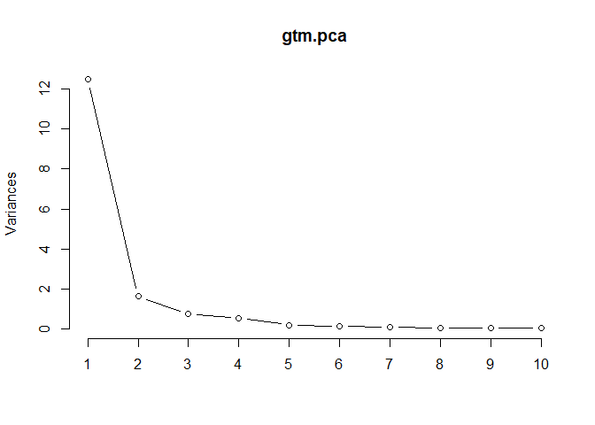

4\_wind\_data.rmd
================
iganelin
November 13, 2017

### Loading libraries

``` r
library(tidyverse)
library(knitr)
library(magrittr)
library(dplyr)
library(readr)
library(stringr)
library(ggplot2)
library(ggfortify)
library(meme)
```

``` r
u <- "http://i0.kym-cdn.com/entries/icons/mobile/000/000/745/success.jpg"
mmplot(u) + mm_caption("Homework 7", "Yes! Give me more to `make`!", color="green")
```


The function reads the raw csv file with wind data, cleans it by reformating the columns' names, and removing a few unused variables.

``` r
read_wind_data <- function(gtm.rawData, save_flag){
  #Reads the wind turbine data CSV, cleans and prints it out.
  #gtm.rawData <- read.csv(input, header = TRUE)
  gtm.dat <- within(gtm.rawData, rm("X.GV.SD_04","X.GV.SD_05","X.GV.SD_38", "X.GV.HRR_GeneratorWindingTemp.1"))
  c_names <- colnames(gtm.dat, do.NULL = TRUE, prefix = "col")
  raw_data <- str_replace(c_names, "X.GV.", "")
  names(gtm.dat) <- raw_data

  return(gtm.dat)
}
```

Function that creates a folder in the root directory.

``` r
mkdirs <- function(fp) {
    if(!file.exists(fp)) {
        mkdirs(dirname(source_local(), fp))
        dir.create(fp)
    }
} 
```

Function plots var1 against var2 from data-frame df and saves if save\_flag == TRUE:

``` r
plot_and_save <- function(df, var1, var2, save_flag){
    my_plot <- ggplot(df, aes(df[[var1]], df[[var2]])) +
      geom_point() +
      geom_smooth(se=FALSE)
  
    if(save_flag == TRUE){
    #mkdirs(media)
        plotname <- str_c("media/", var1,"_", var2, "_plot.png")
        ggsave(plotname, plot = my_plot)
    }
}
```

PCA and Linear Regression on the wind data.

``` r
le_lin_fit <- function(vars, gentemp, save_flag=TRUE) {
  PCA <- prcomp(vars, center = TRUE, scale. = TRUE) 
  print(PCA$rotation)
  summary(PCA)
  the_fit <- lm(gentemp ~ vars$HRR_kVAR + vars$HRR_WTCorrectedWindSpeed)
  #OR
  #mutate(the_fit = map(data, ~ lm(gtm.gentemp ~ PCA$rotation, data = .x)))
  coef(the_fit)
  if(save_flag == TRUE){
    plotname <- str_c("media/", "PCA_", vars,"_", gentemp, "_plot.jpg")
    my_plot <- plot(PCA, type = "l")
    ggsave(plotname, plot = my_plot)
    }
  }
```

Let's plot a few graphs and complete PCA analysis for generator temperature using the rest of the variables.

``` r
input_csv <- read.csv(file="clean_wind_data.csv", header=TRUE, sep=",")
plot_and_save(input_csv, "HRR_WTCorrectedWindSpeed", "HRR_kW", TRUE)
```

    ## Saving 7 x 5 in image

    ## `geom_smooth()` using method = 'gam'

``` r
plot_and_save(input_csv, "HRR_WTCorrectedWindSpeed", "HRR_GearboxOilTemp", TRUE)
```

    ## Saving 7 x 5 in image
    ## `geom_smooth()` using method = 'gam'

``` r
gtm.dat <- input_csv

end = ncol(input_csv)
gtm.gentemp <- gtm.dat[,end]
gtm.vars <- gtm.dat[,4:end-1]

le_lin_fit(gtm.vars, gtm.gentemp, save_flag=FALSE)
```

    ##                                               PC1         PC2         PC3
    ## HRR_kWLastMinAve                        0.2694277 -0.02322375 -0.03184289
    ## HRR_kVAR                               -0.2639943  0.10864757 -0.14978710
    ## HRR_kW                                  0.2755433 -0.07586693  0.04008918
    ## primaryLovatoReadings.EqvPowerFactor    0.1543677  0.07390814 -0.95044475
    ## primaryLovatoReadings.EqvActivePower    0.2758620 -0.07504541  0.05568773
    ## primaryLovatoReadings.EqvReactivePower -0.2653991  0.11019958 -0.15274527
    ## primaryLovatoReadings.L1PhaseVoltage    0.2672072 -0.10046280 -0.04269043
    ## primaryLovatoReadings.L2PhaseVoltage    0.2608719 -0.10616909 -0.06449137
    ## primaryLovatoReadings.L3PhaseVoltage    0.2507694 -0.09073555 -0.06138340
    ## HRR_WTCorrectedWindSpeed                0.2691140 -0.02878778  0.02487058
    ## primaryLovatoReadings.L1Current         0.2753698 -0.07947220  0.07167282
    ## primaryLovatoReadings.L2Current         0.2749689 -0.08304476  0.08104972
    ## primaryLovatoReadings.L3Current         0.2737410 -0.08319053  0.08210071
    ## HRR_GeneratorWindingTemp                0.2576492  0.21187422 -0.01571583
    ## HRR_NacelleAirTemp                      0.1306331  0.68498134  0.10589402
    ## HRR_OutsideAirTemp                      0.1638464  0.62770457  0.06992898
    ##                                                PC4         PC5         PC6
    ## HRR_kWLastMinAve                        0.05553563  0.51543996  0.30325915
    ## HRR_kVAR                               -0.24180561  0.40793458 -0.33436958
    ## HRR_kW                                  0.16447810  0.01570958  0.01881254
    ## primaryLovatoReadings.EqvPowerFactor    0.20757214 -0.12932588 -0.02948340
    ## primaryLovatoReadings.EqvActivePower    0.18688915 -0.06335173  0.13740080
    ## primaryLovatoReadings.EqvReactivePower -0.23967144  0.39865323 -0.25827865
    ## primaryLovatoReadings.L1PhaseVoltage   -0.38113091 -0.05772633 -0.07271088
    ## primaryLovatoReadings.L2PhaseVoltage   -0.47473960 -0.10837129 -0.01113263
    ## primaryLovatoReadings.L3PhaseVoltage   -0.58638016 -0.19095623  0.05592986
    ## HRR_WTCorrectedWindSpeed                0.11151021  0.02498727 -0.10798173
    ## primaryLovatoReadings.L1Current         0.11664510  0.11726840 -0.40013941
    ## primaryLovatoReadings.L2Current         0.12124726  0.11751135 -0.39227630
    ## primaryLovatoReadings.L3Current         0.11028835  0.13879935 -0.39819511
    ## HRR_GeneratorWindingTemp               -0.07449039  0.50061994  0.44462706
    ## HRR_NacelleAirTemp                     -0.05351327 -0.16396341 -0.04484117
    ## HRR_OutsideAirTemp                      0.01178893 -0.10726383 -0.13025473
    ##                                                 PC7          PC8
    ## HRR_kWLastMinAve                        0.078473874  0.616030862
    ## HRR_kVAR                               -0.069592143 -0.002250357
    ## HRR_kW                                  0.136689966  0.062102216
    ## primaryLovatoReadings.EqvPowerFactor    0.037744583 -0.042772363
    ## primaryLovatoReadings.EqvActivePower    0.086025263  0.022243109
    ## primaryLovatoReadings.EqvReactivePower -0.047146155  0.073150604
    ## primaryLovatoReadings.L1PhaseVoltage    0.036030289  0.011960083
    ## primaryLovatoReadings.L2PhaseVoltage    0.034262280  0.029009246
    ## primaryLovatoReadings.L3PhaseVoltage   -0.015747924  0.049831424
    ## HRR_WTCorrectedWindSpeed               -0.947637626  0.035861085
    ## primaryLovatoReadings.L1Current         0.138557699 -0.129093596
    ## primaryLovatoReadings.L2Current         0.126097545 -0.148795360
    ## primaryLovatoReadings.L3Current         0.142585694 -0.050923607
    ## HRR_GeneratorWindingTemp               -0.003850837 -0.575722838
    ## HRR_NacelleAirTemp                      0.010312378 -0.216817354
    ## HRR_OutsideAirTemp                      0.054580630  0.429360265
    ##                                                PC9         PC10
    ## HRR_kWLastMinAve                       -0.21134537  0.031827638
    ## HRR_kVAR                                0.48393425 -0.032038808
    ## HRR_kW                                  0.70491249 -0.073718391
    ## primaryLovatoReadings.EqvPowerFactor   -0.04948559 -0.003036451
    ## primaryLovatoReadings.EqvActivePower    0.39191655  0.081516559
    ## primaryLovatoReadings.EqvReactivePower -0.01691257  0.076841441
    ## primaryLovatoReadings.L1PhaseVoltage   -0.02282035 -0.523466154
    ## primaryLovatoReadings.L2PhaseVoltage    0.01787685  0.097480857
    ## primaryLovatoReadings.L3PhaseVoltage    0.01922059  0.295788570
    ## HRR_WTCorrectedWindSpeed                0.02210821 -0.005883316
    ## primaryLovatoReadings.L1Current        -0.12534126  0.363609360
    ## primaryLovatoReadings.L2Current        -0.11382470  0.367597515
    ## primaryLovatoReadings.L3Current        -0.18859781 -0.578435043
    ## HRR_GeneratorWindingTemp               -0.03265403 -0.001592876
    ## HRR_NacelleAirTemp                     -0.01628376 -0.062133549
    ## HRR_OutsideAirTemp                      0.02529997  0.055969646
    ##                                                PC11        PC12
    ## HRR_kWLastMinAve                       -0.172605848  0.26967243
    ## HRR_kVAR                               -0.551721334 -0.08640976
    ## HRR_kW                                  0.258280789  0.36365471
    ## primaryLovatoReadings.EqvPowerFactor   -0.021094905  0.01799963
    ## primaryLovatoReadings.EqvActivePower    0.119623679 -0.35981059
    ## primaryLovatoReadings.EqvReactivePower  0.747039133  0.07060450
    ## primaryLovatoReadings.L1PhaseVoltage    0.041397038 -0.11183953
    ## primaryLovatoReadings.L2PhaseVoltage    0.064210083 -0.19101186
    ## primaryLovatoReadings.L3PhaseVoltage   -0.081815967  0.23308692
    ## HRR_WTCorrectedWindSpeed                0.030111476  0.01369662
    ## primaryLovatoReadings.L1Current        -0.041876971  0.03171767
    ## primaryLovatoReadings.L2Current        -0.048507628 -0.02629238
    ## primaryLovatoReadings.L3Current        -0.009234097  0.02194536
    ## HRR_GeneratorWindingTemp                0.035199484 -0.22509115
    ## HRR_NacelleAirTemp                     -0.063800606  0.51209795
    ## HRR_OutsideAirTemp                      0.057800314 -0.48393469
    ##                                                PC13          PC14
    ## HRR_kWLastMinAve                       -0.154835293  0.0850483180
    ## HRR_kVAR                               -0.034456528  0.0761552314
    ## HRR_kW                                  0.098077343 -0.3943473684
    ## primaryLovatoReadings.EqvPowerFactor    0.010508201  0.0007486192
    ## primaryLovatoReadings.EqvActivePower   -0.142769881  0.7240880858
    ## primaryLovatoReadings.EqvReactivePower -0.013837307  0.1822414144
    ## primaryLovatoReadings.L1PhaseVoltage   -0.228478117 -0.0307410288
    ## primaryLovatoReadings.L2PhaseVoltage   -0.493837640 -0.2251473865
    ## primaryLovatoReadings.L3PhaseVoltage    0.574164510  0.2198113731
    ## HRR_WTCorrectedWindSpeed               -0.007489965 -0.0128960152
    ## primaryLovatoReadings.L1Current         0.008488319  0.0032476739
    ## primaryLovatoReadings.L2Current        -0.178635889 -0.1169014624
    ## primaryLovatoReadings.L3Current         0.323851706  0.1586688322
    ## HRR_GeneratorWindingTemp                0.171342051 -0.1440012171
    ## HRR_NacelleAirTemp                     -0.300591539  0.2473304354
    ## HRR_OutsideAirTemp                      0.249318074 -0.2303488050
    ##                                                PC15         PC16
    ## HRR_kWLastMinAve                       -0.006652025  0.005222930
    ## HRR_kVAR                                0.021537685 -0.001463822
    ## HRR_kW                                  0.005739461 -0.008166088
    ## primaryLovatoReadings.EqvPowerFactor    0.002980929  0.009017333
    ## primaryLovatoReadings.EqvActivePower    0.007798602  0.026220834
    ## primaryLovatoReadings.EqvReactivePower -0.018123255  0.021560614
    ## primaryLovatoReadings.L1PhaseVoltage   -0.632218989 -0.140557306
    ## primaryLovatoReadings.L2PhaseVoltage    0.576398587  0.004538336
    ## primaryLovatoReadings.L3PhaseVoltage   -0.043704827  0.100860531
    ## HRR_WTCorrectedWindSpeed                0.014757610 -0.007104292
    ## primaryLovatoReadings.L1Current        -0.050719967 -0.732153513
    ## primaryLovatoReadings.L2Current        -0.282029219  0.643622540
    ## primaryLovatoReadings.L3Current         0.423655096  0.135019268
    ## HRR_GeneratorWindingTemp                0.004599669 -0.007468716
    ## HRR_NacelleAirTemp                      0.040262223  0.007634083
    ## HRR_OutsideAirTemp                     -0.041926865 -0.005187987

``` r
gtm.pca <- prcomp(gtm.vars, center = TRUE, scale. = TRUE) 
head(gtm.pca$rotation)
```

    ##                                               PC1         PC2         PC3
    ## HRR_kWLastMinAve                        0.2694277 -0.02322375 -0.03184289
    ## HRR_kVAR                               -0.2639943  0.10864757 -0.14978710
    ## HRR_kW                                  0.2755433 -0.07586693  0.04008918
    ## primaryLovatoReadings.EqvPowerFactor    0.1543677  0.07390814 -0.95044475
    ## primaryLovatoReadings.EqvActivePower    0.2758620 -0.07504541  0.05568773
    ## primaryLovatoReadings.EqvReactivePower -0.2653991  0.11019958 -0.15274527
    ##                                                PC4         PC5         PC6
    ## HRR_kWLastMinAve                        0.05553563  0.51543996  0.30325915
    ## HRR_kVAR                               -0.24180561  0.40793458 -0.33436958
    ## HRR_kW                                  0.16447810  0.01570958  0.01881254
    ## primaryLovatoReadings.EqvPowerFactor    0.20757214 -0.12932588 -0.02948340
    ## primaryLovatoReadings.EqvActivePower    0.18688915 -0.06335173  0.13740080
    ## primaryLovatoReadings.EqvReactivePower -0.23967144  0.39865323 -0.25827865
    ##                                                PC7          PC8
    ## HRR_kWLastMinAve                        0.07847387  0.616030862
    ## HRR_kVAR                               -0.06959214 -0.002250357
    ## HRR_kW                                  0.13668997  0.062102216
    ## primaryLovatoReadings.EqvPowerFactor    0.03774458 -0.042772363
    ## primaryLovatoReadings.EqvActivePower    0.08602526  0.022243109
    ## primaryLovatoReadings.EqvReactivePower -0.04714616  0.073150604
    ##                                                PC9         PC10
    ## HRR_kWLastMinAve                       -0.21134537  0.031827638
    ## HRR_kVAR                                0.48393425 -0.032038808
    ## HRR_kW                                  0.70491249 -0.073718391
    ## primaryLovatoReadings.EqvPowerFactor   -0.04948559 -0.003036451
    ## primaryLovatoReadings.EqvActivePower    0.39191655  0.081516559
    ## primaryLovatoReadings.EqvReactivePower -0.01691257  0.076841441
    ##                                               PC11        PC12        PC13
    ## HRR_kWLastMinAve                       -0.17260585  0.26967243 -0.15483529
    ## HRR_kVAR                               -0.55172133 -0.08640976 -0.03445653
    ## HRR_kW                                  0.25828079  0.36365471  0.09807734
    ## primaryLovatoReadings.EqvPowerFactor   -0.02109491  0.01799963  0.01050820
    ## primaryLovatoReadings.EqvActivePower    0.11962368 -0.35981059 -0.14276988
    ## primaryLovatoReadings.EqvReactivePower  0.74703913  0.07060450 -0.01383731
    ##                                                 PC14         PC15
    ## HRR_kWLastMinAve                        0.0850483180 -0.006652025
    ## HRR_kVAR                                0.0761552314  0.021537685
    ## HRR_kW                                 -0.3943473684  0.005739461
    ## primaryLovatoReadings.EqvPowerFactor    0.0007486192  0.002980929
    ## primaryLovatoReadings.EqvActivePower    0.7240880858  0.007798602
    ## primaryLovatoReadings.EqvReactivePower  0.1822414144 -0.018123255
    ##                                                PC16
    ## HRR_kWLastMinAve                        0.005222930
    ## HRR_kVAR                               -0.001463822
    ## HRR_kW                                 -0.008166088
    ## primaryLovatoReadings.EqvPowerFactor    0.009017333
    ## primaryLovatoReadings.EqvActivePower    0.026220834
    ## primaryLovatoReadings.EqvReactivePower  0.021560614

``` r
plot_pca <- plot(gtm.pca, type = "l")
```



``` r
ggsave("media/plot_pca.png", plot = plot_pca)
```

    ## Saving 7 x 5 in image

``` r
summary(head(gtm.pca))
```

    ##          Length Class  Mode   
    ## sdev        16  -none- numeric
    ## rotation   256  -none- numeric
    ## center      16  -none- numeric
    ## scale       16  -none- numeric
    ## x        80368  -none- numeric
