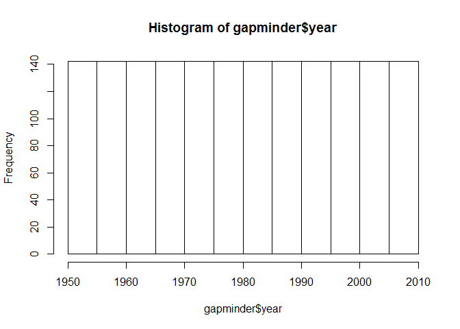
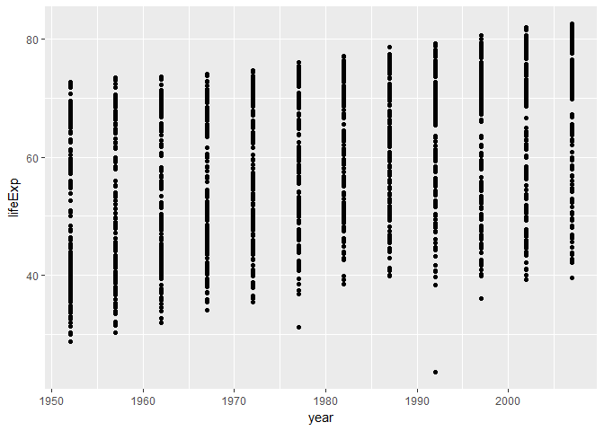
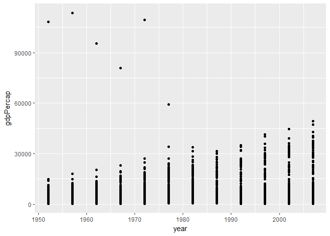
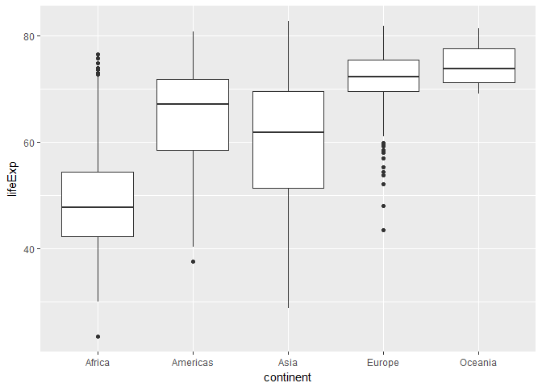

hw2
================
iganelin
September 20, 2017

Homework 2
==========

``` r
library(gapminder)
library(tidyverse)
```

    ## Loading tidyverse: ggplot2
    ## Loading tidyverse: tibble
    ## Loading tidyverse: tidyr
    ## Loading tidyverse: readr
    ## Loading tidyverse: purrr
    ## Loading tidyverse: dplyr

    ## Conflicts with tidy packages ----------------------------------------------

    ## filter(): dplyr, stats
    ## lag():    dplyr, stats

Smell test the data
-------------------

-   Is it a data.frame, a matrix, a vector, a list?

``` r
typeof(gapminder) #list
```

    ## [1] "list"

``` r
head(gapminder) 
```

    ## # A tibble: 6 x 6
    ##       country continent  year lifeExp      pop gdpPercap
    ##        <fctr>    <fctr> <int>   <dbl>    <int>     <dbl>
    ## 1 Afghanistan      Asia  1952  28.801  8425333  779.4453
    ## 2 Afghanistan      Asia  1957  30.332  9240934  820.8530
    ## 3 Afghanistan      Asia  1962  31.997 10267083  853.1007
    ## 4 Afghanistan      Asia  1967  34.020 11537966  836.1971
    ## 5 Afghanistan      Asia  1972  36.088 13079460  739.9811
    ## 6 Afghanistan      Asia  1977  38.438 14880372  786.1134

-   How many variables/columns?
-   How many rows/observations?
-   Can you get these facts about “extent” or “size” in more than one way?

``` r
dim(gapminder)  # rows x cols: 1704x6
```

    ## [1] 1704    6

``` r
ncol(gapminder) # 6
```

    ## [1] 6

``` r
nrow(gapminder) # 1704
```

    ## [1] 1704

-   What data type is each variable?

``` r
typeof(gapminder$country)   # integer
```

    ## [1] "integer"

``` r
typeof(gapminder$continent) # integer
```

    ## [1] "integer"

``` r
typeof(gapminder$year)      # integer
```

    ## [1] "integer"

``` r
typeof(gapminder$lifeExp)   # double
```

    ## [1] "double"

``` r
typeof(gapminder$pop)       # integer
```

    ## [1] "integer"

``` r
typeof(gapminder$gdpPercap) # double
```

    ## [1] "double"

Explore individual variables
============================

-   What are possible values (or range, whichever is appropriate) of each variable?

``` r
summary(gapminder$year)
```

    ##    Min. 1st Qu.  Median    Mean 3rd Qu.    Max. 
    ##    1952    1966    1980    1980    1993    2007

-   What values are typical? What’s the spread? What’s the distribution? Etc., tailored to the variable at hand. *Mean: 1980, spread: from 1952 till 2007*
-   Distribution:

``` r
hist(gapminder$year)
```



Explore various plot types
==========================

-   A scatterplot of two quantitative variables.

``` r
ggplot(gapminder, aes(x = year, y = lifeExp)) + geom_point()
```



``` r
ggplot(gapminder, aes(x = year, y = gdpPercap)) + geom_point()
```



-   A plot of one quantitative variable. Maybe a histogram or densityplot or frequency polygon.

``` r
hist(gapminder$lifeExp)
```


-   A plot of one quantitative variable and one categorical. Maybe boxplots for several continents or countries.

``` r
ggplot(gapminder, aes(x = continent, y = lifeExp)) + geom_boxplot()
```



Use filter(), select() and %&gt;%
=================================

-   Use filter() to create data subsets that you want to plot.

``` r
filter(gapminder, continent=="Asia" & pop>=2.960e+07)
```

    ## # A tibble: 126 x 6
    ##        country continent  year lifeExp       pop gdpPercap
    ##         <fctr>    <fctr> <int>   <dbl>     <int>     <dbl>
    ##  1 Afghanistan      Asia  2007  43.828  31889923  974.5803
    ##  2  Bangladesh      Asia  1952  37.484  46886859  684.2442
    ##  3  Bangladesh      Asia  1957  39.348  51365468  661.6375
    ##  4  Bangladesh      Asia  1962  41.216  56839289  686.3416
    ##  5  Bangladesh      Asia  1967  43.453  62821884  721.1861
    ##  6  Bangladesh      Asia  1972  45.252  70759295  630.2336
    ##  7  Bangladesh      Asia  1977  46.923  80428306  659.8772
    ##  8  Bangladesh      Asia  1982  50.009  93074406  676.9819
    ##  9  Bangladesh      Asia  1987  52.819 103764241  751.9794
    ## 10  Bangladesh      Asia  1992  56.018 113704579  837.8102
    ## # ... with 116 more rows

``` r
filter(gapminder, continent=="Asia")
```

    ## # A tibble: 396 x 6
    ##        country continent  year lifeExp      pop gdpPercap
    ##         <fctr>    <fctr> <int>   <dbl>    <int>     <dbl>
    ##  1 Afghanistan      Asia  1952  28.801  8425333  779.4453
    ##  2 Afghanistan      Asia  1957  30.332  9240934  820.8530
    ##  3 Afghanistan      Asia  1962  31.997 10267083  853.1007
    ##  4 Afghanistan      Asia  1967  34.020 11537966  836.1971
    ##  5 Afghanistan      Asia  1972  36.088 13079460  739.9811
    ##  6 Afghanistan      Asia  1977  38.438 14880372  786.1134
    ##  7 Afghanistan      Asia  1982  39.854 12881816  978.0114
    ##  8 Afghanistan      Asia  1987  40.822 13867957  852.3959
    ##  9 Afghanistan      Asia  1992  41.674 16317921  649.3414
    ## 10 Afghanistan      Asia  1997  41.763 22227415  635.3414
    ## # ... with 386 more rows

-   Practice piping together filter() and select(). Possibly even piping into ggplot().

``` r
gapminder %>% 
  filter(continent=="Asia" & pop>=2.960e+07) %>% 
  select(-gdpPercap)
```

    ## # A tibble: 126 x 5
    ##        country continent  year lifeExp       pop
    ##         <fctr>    <fctr> <int>   <dbl>     <int>
    ##  1 Afghanistan      Asia  2007  43.828  31889923
    ##  2  Bangladesh      Asia  1952  37.484  46886859
    ##  3  Bangladesh      Asia  1957  39.348  51365468
    ##  4  Bangladesh      Asia  1962  41.216  56839289
    ##  5  Bangladesh      Asia  1967  43.453  62821884
    ##  6  Bangladesh      Asia  1972  45.252  70759295
    ##  7  Bangladesh      Asia  1977  46.923  80428306
    ##  8  Bangladesh      Asia  1982  50.009  93074406
    ##  9  Bangladesh      Asia  1987  52.819 103764241
    ## 10  Bangladesh      Asia  1992  56.018 113704579
    ## # ... with 116 more rows

But I want to do more!
======================
