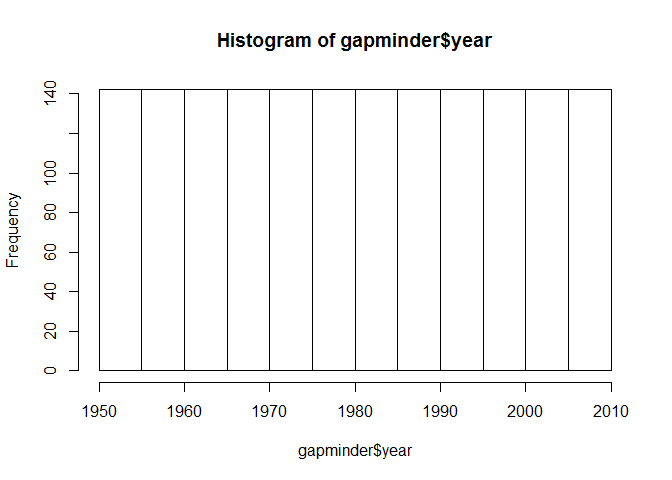

Homework 2
==========

Loading libraries

    library(gapminder)
    library(tidyverse)

    ## Loading tidyverse: ggplot2
    ## Loading tidyverse: tibble
    ## Loading tidyverse: tidyr
    ## Loading tidyverse: readr
    ## Loading tidyverse: purrr
    ## Loading tidyverse: dplyr

    ## Conflicts with tidy packages ----------------------------------------------

    ## filter(): dplyr, stats
    ## lag():    dplyr, stats

    library(knitr)
    library(dplyr)

Smell test the data
-------------------

-   Is it a data.frame, a matrix, a vector, a list?

<!-- -->

    typeof(gapminder) #list

    ## [1] "list"

    head(gapminder) 

    ## # A tibble: 6 x 6
    ##       country continent  year lifeExp      pop gdpPercap
    ##        <fctr>    <fctr> <int>   <dbl>    <int>     <dbl>
    ## 1 Afghanistan      Asia  1952  28.801  8425333  779.4453
    ## 2 Afghanistan      Asia  1957  30.332  9240934  820.8530
    ## 3 Afghanistan      Asia  1962  31.997 10267083  853.1007
    ## 4 Afghanistan      Asia  1967  34.020 11537966  836.1971
    ## 5 Afghanistan      Asia  1972  36.088 13079460  739.9811
    ## 6 Afghanistan      Asia  1977  38.438 14880372  786.1134

-   How many variables/columns?
-   How many rows/observations?
-   Can you get these facts about “extent” or “size” in more than one
    way?

<!-- -->

    dim(gapminder)  # rows x cols: 1704x6

    ## [1] 1704    6

    ncol(gapminder) # 6

    ## [1] 6

    nrow(gapminder) # 1704

    ## [1] 1704

-   What data type is each variable?

<!-- -->

    typeof(gapminder$country)   # integer

    ## [1] "integer"

    typeof(gapminder$continent) # integer

    ## [1] "integer"

    typeof(gapminder$year)      # integer

    ## [1] "integer"

    typeof(gapminder$lifeExp)   # double

    ## [1] "double"

    typeof(gapminder$pop)       # integer

    ## [1] "integer"

    typeof(gapminder$gdpPercap) # double

    ## [1] "double"

Explore individual variables
============================

-   What are possible values (or range, whichever is appropriate) of
    each variable?

<!-- -->

    summary(gapminder$year)

    ##    Min. 1st Qu.  Median    Mean 3rd Qu.    Max. 
    ##    1952    1966    1980    1980    1993    2007

-   What values are typical? What’s the spread? What’s the distribution?
    Etc., tailored to the variable at hand.

*Mean: 1980, spread: from 1952 till 2007* - Distribution:

    hist(gapminder$year)

Explore various plot types
==========================

-   A scatterplot of two quantitative variables.

<!-- -->

    ggplot(gapminder, aes(x = year, y = lifeExp)) + geom_point()

    ggplot(gapminder, aes(x = year, y = gdpPercap)) + geom_point()

-   A plot of one quantitative variable. Maybe a histogram or
    densityplot or frequency polygon.

<!-- -->

    hist(gapminder$lifeExp)

-   A plot of one quantitative variable and one categorical. Maybe
    boxplots for several continents or countries.

<!-- -->

    ggplot(gapminder, aes(x = continent, y = lifeExp)) + geom_boxplot()

Use filter(), select() and %&gt;%
=================================

-   Use filter() to create data subsets that you want to plot.

<!-- -->

    filter(gapminder, continent=="Asia" & pop>=2.960e+07)

    ## # A tibble: 126 x 6
    ##        country continent  year lifeExp       pop gdpPercap
    ##         <fctr>    <fctr> <int>   <dbl>     <int>     <dbl>
    ##  1 Afghanistan      Asia  2007  43.828  31889923  974.5803
    ##  2  Bangladesh      Asia  1952  37.484  46886859  684.2442
    ##  3  Bangladesh      Asia  1957  39.348  51365468  661.6375
    ##  4  Bangladesh      Asia  1962  41.216  56839289  686.3416
    ##  5  Bangladesh      Asia  1967  43.453  62821884  721.1861
    ##  6  Bangladesh      Asia  1972  45.252  70759295  630.2336
    ##  7  Bangladesh      Asia  1977  46.923  80428306  659.8772
    ##  8  Bangladesh      Asia  1982  50.009  93074406  676.9819
    ##  9  Bangladesh      Asia  1987  52.819 103764241  751.9794
    ## 10  Bangladesh      Asia  1992  56.018 113704579  837.8102
    ## # ... with 116 more rows

    filter(gapminder, continent=="Asia")

    ## # A tibble: 396 x 6
    ##        country continent  year lifeExp      pop gdpPercap
    ##         <fctr>    <fctr> <int>   <dbl>    <int>     <dbl>
    ##  1 Afghanistan      Asia  1952  28.801  8425333  779.4453
    ##  2 Afghanistan      Asia  1957  30.332  9240934  820.8530
    ##  3 Afghanistan      Asia  1962  31.997 10267083  853.1007
    ##  4 Afghanistan      Asia  1967  34.020 11537966  836.1971
    ##  5 Afghanistan      Asia  1972  36.088 13079460  739.9811
    ##  6 Afghanistan      Asia  1977  38.438 14880372  786.1134
    ##  7 Afghanistan      Asia  1982  39.854 12881816  978.0114
    ##  8 Afghanistan      Asia  1987  40.822 13867957  852.3959
    ##  9 Afghanistan      Asia  1992  41.674 16317921  649.3414
    ## 10 Afghanistan      Asia  1997  41.763 22227415  635.3414
    ## # ... with 386 more rows

-   Practice piping together filter() and select(). Possibly even piping
    into ggplot().

<!-- -->

    gapminder %>% 
      filter(continent=="Asia" & pop>=2.960e+07) %>% 
      select(-gdpPercap)

    ## # A tibble: 126 x 5
    ##        country continent  year lifeExp       pop
    ##         <fctr>    <fctr> <int>   <dbl>     <int>
    ##  1 Afghanistan      Asia  2007  43.828  31889923
    ##  2  Bangladesh      Asia  1952  37.484  46886859
    ##  3  Bangladesh      Asia  1957  39.348  51365468
    ##  4  Bangladesh      Asia  1962  41.216  56839289
    ##  5  Bangladesh      Asia  1967  43.453  62821884
    ##  6  Bangladesh      Asia  1972  45.252  70759295
    ##  7  Bangladesh      Asia  1977  46.923  80428306
    ##  8  Bangladesh      Asia  1982  50.009  93074406
    ##  9  Bangladesh      Asia  1987  52.819 103764241
    ## 10  Bangladesh      Asia  1992  56.018 113704579
    ## # ... with 116 more rows

But I want to do more!
======================

Evaluate this code and describe the result. Presumably the analyst’s
intent was to get the data for Rwanda and Afghanistan. Did they succeed?
Why or why not? If not, what is the correct way to do this?

    filter(gapminder, country == c("Rwanda", "Afghanistan"))

    ## # A tibble: 12 x 6
    ##        country continent  year lifeExp      pop gdpPercap
    ##         <fctr>    <fctr> <int>   <dbl>    <int>     <dbl>
    ##  1 Afghanistan      Asia  1957  30.332  9240934  820.8530
    ##  2 Afghanistan      Asia  1967  34.020 11537966  836.1971
    ##  3 Afghanistan      Asia  1977  38.438 14880372  786.1134
    ##  4 Afghanistan      Asia  1987  40.822 13867957  852.3959
    ##  5 Afghanistan      Asia  1997  41.763 22227415  635.3414
    ##  6 Afghanistan      Asia  2007  43.828 31889923  974.5803
    ##  7      Rwanda    Africa  1952  40.000  2534927  493.3239
    ##  8      Rwanda    Africa  1962  43.000  3051242  597.4731
    ##  9      Rwanda    Africa  1972  44.600  3992121  590.5807
    ## 10      Rwanda    Africa  1982  46.218  5507565  881.5706
    ## 11      Rwanda    Africa  1992  23.599  7290203  737.0686
    ## 12      Rwanda    Africa  2002  43.413  7852401  785.6538

Answer: No.

The right way would be:

    filter(gapminder, country %in% c("Rwanda", "Afghanistan"))

    ## # A tibble: 24 x 6
    ##        country continent  year lifeExp      pop gdpPercap
    ##         <fctr>    <fctr> <int>   <dbl>    <int>     <dbl>
    ##  1 Afghanistan      Asia  1952  28.801  8425333  779.4453
    ##  2 Afghanistan      Asia  1957  30.332  9240934  820.8530
    ##  3 Afghanistan      Asia  1962  31.997 10267083  853.1007
    ##  4 Afghanistan      Asia  1967  34.020 11537966  836.1971
    ##  5 Afghanistan      Asia  1972  36.088 13079460  739.9811
    ##  6 Afghanistan      Asia  1977  38.438 14880372  786.1134
    ##  7 Afghanistan      Asia  1982  39.854 12881816  978.0114
    ##  8 Afghanistan      Asia  1987  40.822 13867957  852.3959
    ##  9 Afghanistan      Asia  1992  41.674 16317921  649.3414
    ## 10 Afghanistan      Asia  1997  41.763 22227415  635.3414
    ## # ... with 14 more rows

-   Present numerical tables in a more attractive form, such as
    using knitr::kable().

<!-- -->

    gapminder %>% 
      filter(country %in% c("Rwanda", "Afghanistan")) %>% 
      kable(., format = "markdown", caption = "Kable Rmd Good Looking Table")

<table>
<thead>
<tr class="header">
<th align="left">country</th>
<th align="left">continent</th>
<th align="right">year</th>
<th align="right">lifeExp</th>
<th align="right">pop</th>
<th align="right">gdpPercap</th>
</tr>
</thead>
<tbody>
<tr class="odd">
<td align="left">Afghanistan</td>
<td align="left">Asia</td>
<td align="right">1952</td>
<td align="right">28.801</td>
<td align="right">8425333</td>
<td align="right">779.4453</td>
</tr>
<tr class="even">
<td align="left">Afghanistan</td>
<td align="left">Asia</td>
<td align="right">1957</td>
<td align="right">30.332</td>
<td align="right">9240934</td>
<td align="right">820.8530</td>
</tr>
<tr class="odd">
<td align="left">Afghanistan</td>
<td align="left">Asia</td>
<td align="right">1962</td>
<td align="right">31.997</td>
<td align="right">10267083</td>
<td align="right">853.1007</td>
</tr>
<tr class="even">
<td align="left">Afghanistan</td>
<td align="left">Asia</td>
<td align="right">1967</td>
<td align="right">34.020</td>
<td align="right">11537966</td>
<td align="right">836.1971</td>
</tr>
<tr class="odd">
<td align="left">Afghanistan</td>
<td align="left">Asia</td>
<td align="right">1972</td>
<td align="right">36.088</td>
<td align="right">13079460</td>
<td align="right">739.9811</td>
</tr>
<tr class="even">
<td align="left">Afghanistan</td>
<td align="left">Asia</td>
<td align="right">1977</td>
<td align="right">38.438</td>
<td align="right">14880372</td>
<td align="right">786.1134</td>
</tr>
<tr class="odd">
<td align="left">Afghanistan</td>
<td align="left">Asia</td>
<td align="right">1982</td>
<td align="right">39.854</td>
<td align="right">12881816</td>
<td align="right">978.0114</td>
</tr>
<tr class="even">
<td align="left">Afghanistan</td>
<td align="left">Asia</td>
<td align="right">1987</td>
<td align="right">40.822</td>
<td align="right">13867957</td>
<td align="right">852.3959</td>
</tr>
<tr class="odd">
<td align="left">Afghanistan</td>
<td align="left">Asia</td>
<td align="right">1992</td>
<td align="right">41.674</td>
<td align="right">16317921</td>
<td align="right">649.3414</td>
</tr>
<tr class="even">
<td align="left">Afghanistan</td>
<td align="left">Asia</td>
<td align="right">1997</td>
<td align="right">41.763</td>
<td align="right">22227415</td>
<td align="right">635.3414</td>
</tr>
<tr class="odd">
<td align="left">Afghanistan</td>
<td align="left">Asia</td>
<td align="right">2002</td>
<td align="right">42.129</td>
<td align="right">25268405</td>
<td align="right">726.7341</td>
</tr>
<tr class="even">
<td align="left">Afghanistan</td>
<td align="left">Asia</td>
<td align="right">2007</td>
<td align="right">43.828</td>
<td align="right">31889923</td>
<td align="right">974.5803</td>
</tr>
<tr class="odd">
<td align="left">Rwanda</td>
<td align="left">Africa</td>
<td align="right">1952</td>
<td align="right">40.000</td>
<td align="right">2534927</td>
<td align="right">493.3239</td>
</tr>
<tr class="even">
<td align="left">Rwanda</td>
<td align="left">Africa</td>
<td align="right">1957</td>
<td align="right">41.500</td>
<td align="right">2822082</td>
<td align="right">540.2894</td>
</tr>
<tr class="odd">
<td align="left">Rwanda</td>
<td align="left">Africa</td>
<td align="right">1962</td>
<td align="right">43.000</td>
<td align="right">3051242</td>
<td align="right">597.4731</td>
</tr>
<tr class="even">
<td align="left">Rwanda</td>
<td align="left">Africa</td>
<td align="right">1967</td>
<td align="right">44.100</td>
<td align="right">3451079</td>
<td align="right">510.9637</td>
</tr>
<tr class="odd">
<td align="left">Rwanda</td>
<td align="left">Africa</td>
<td align="right">1972</td>
<td align="right">44.600</td>
<td align="right">3992121</td>
<td align="right">590.5807</td>
</tr>
<tr class="even">
<td align="left">Rwanda</td>
<td align="left">Africa</td>
<td align="right">1977</td>
<td align="right">45.000</td>
<td align="right">4657072</td>
<td align="right">670.0806</td>
</tr>
<tr class="odd">
<td align="left">Rwanda</td>
<td align="left">Africa</td>
<td align="right">1982</td>
<td align="right">46.218</td>
<td align="right">5507565</td>
<td align="right">881.5706</td>
</tr>
<tr class="even">
<td align="left">Rwanda</td>
<td align="left">Africa</td>
<td align="right">1987</td>
<td align="right">44.020</td>
<td align="right">6349365</td>
<td align="right">847.9912</td>
</tr>
<tr class="odd">
<td align="left">Rwanda</td>
<td align="left">Africa</td>
<td align="right">1992</td>
<td align="right">23.599</td>
<td align="right">7290203</td>
<td align="right">737.0686</td>
</tr>
<tr class="even">
<td align="left">Rwanda</td>
<td align="left">Africa</td>
<td align="right">1997</td>
<td align="right">36.087</td>
<td align="right">7212583</td>
<td align="right">589.9445</td>
</tr>
<tr class="odd">
<td align="left">Rwanda</td>
<td align="left">Africa</td>
<td align="right">2002</td>
<td align="right">43.413</td>
<td align="right">7852401</td>
<td align="right">785.6538</td>
</tr>
<tr class="even">
<td align="left">Rwanda</td>
<td align="left">Africa</td>
<td align="right">2007</td>
<td align="right">46.242</td>
<td align="right">8860588</td>
<td align="right">863.0885</td>
</tr>
</tbody>
</table>

-   Use more of the dplyr functions for operating on a single table.

<!-- -->

    gapminder %>% 
      filter(continent=="Asia" & pop>=2.960e+07) %>% 
      select(-pop) %>% 
      mutate(developpedCountries = gdpPercap>20000) %>% 
      kable(., format = "markdown", caption = "Kable Rmd Good Looking Table")

<table>
<thead>
<tr class="header">
<th align="left">country</th>
<th align="left">continent</th>
<th align="right">year</th>
<th align="right">lifeExp</th>
<th align="right">gdpPercap</th>
<th align="left">developpedCountries</th>
</tr>
</thead>
<tbody>
<tr class="odd">
<td align="left">Afghanistan</td>
<td align="left">Asia</td>
<td align="right">2007</td>
<td align="right">43.82800</td>
<td align="right">974.5803</td>
<td align="left">FALSE</td>
</tr>
<tr class="even">
<td align="left">Bangladesh</td>
<td align="left">Asia</td>
<td align="right">1952</td>
<td align="right">37.48400</td>
<td align="right">684.2442</td>
<td align="left">FALSE</td>
</tr>
<tr class="odd">
<td align="left">Bangladesh</td>
<td align="left">Asia</td>
<td align="right">1957</td>
<td align="right">39.34800</td>
<td align="right">661.6375</td>
<td align="left">FALSE</td>
</tr>
<tr class="even">
<td align="left">Bangladesh</td>
<td align="left">Asia</td>
<td align="right">1962</td>
<td align="right">41.21600</td>
<td align="right">686.3416</td>
<td align="left">FALSE</td>
</tr>
<tr class="odd">
<td align="left">Bangladesh</td>
<td align="left">Asia</td>
<td align="right">1967</td>
<td align="right">43.45300</td>
<td align="right">721.1861</td>
<td align="left">FALSE</td>
</tr>
<tr class="even">
<td align="left">Bangladesh</td>
<td align="left">Asia</td>
<td align="right">1972</td>
<td align="right">45.25200</td>
<td align="right">630.2336</td>
<td align="left">FALSE</td>
</tr>
<tr class="odd">
<td align="left">Bangladesh</td>
<td align="left">Asia</td>
<td align="right">1977</td>
<td align="right">46.92300</td>
<td align="right">659.8772</td>
<td align="left">FALSE</td>
</tr>
<tr class="even">
<td align="left">Bangladesh</td>
<td align="left">Asia</td>
<td align="right">1982</td>
<td align="right">50.00900</td>
<td align="right">676.9819</td>
<td align="left">FALSE</td>
</tr>
<tr class="odd">
<td align="left">Bangladesh</td>
<td align="left">Asia</td>
<td align="right">1987</td>
<td align="right">52.81900</td>
<td align="right">751.9794</td>
<td align="left">FALSE</td>
</tr>
<tr class="even">
<td align="left">Bangladesh</td>
<td align="left">Asia</td>
<td align="right">1992</td>
<td align="right">56.01800</td>
<td align="right">837.8102</td>
<td align="left">FALSE</td>
</tr>
<tr class="odd">
<td align="left">Bangladesh</td>
<td align="left">Asia</td>
<td align="right">1997</td>
<td align="right">59.41200</td>
<td align="right">972.7700</td>
<td align="left">FALSE</td>
</tr>
<tr class="even">
<td align="left">Bangladesh</td>
<td align="left">Asia</td>
<td align="right">2002</td>
<td align="right">62.01300</td>
<td align="right">1136.3904</td>
<td align="left">FALSE</td>
</tr>
<tr class="odd">
<td align="left">Bangladesh</td>
<td align="left">Asia</td>
<td align="right">2007</td>
<td align="right">64.06200</td>
<td align="right">1391.2538</td>
<td align="left">FALSE</td>
</tr>
<tr class="even">
<td align="left">China</td>
<td align="left">Asia</td>
<td align="right">1952</td>
<td align="right">44.00000</td>
<td align="right">400.4486</td>
<td align="left">FALSE</td>
</tr>
<tr class="odd">
<td align="left">China</td>
<td align="left">Asia</td>
<td align="right">1957</td>
<td align="right">50.54896</td>
<td align="right">575.9870</td>
<td align="left">FALSE</td>
</tr>
<tr class="even">
<td align="left">China</td>
<td align="left">Asia</td>
<td align="right">1962</td>
<td align="right">44.50136</td>
<td align="right">487.6740</td>
<td align="left">FALSE</td>
</tr>
<tr class="odd">
<td align="left">China</td>
<td align="left">Asia</td>
<td align="right">1967</td>
<td align="right">58.38112</td>
<td align="right">612.7057</td>
<td align="left">FALSE</td>
</tr>
<tr class="even">
<td align="left">China</td>
<td align="left">Asia</td>
<td align="right">1972</td>
<td align="right">63.11888</td>
<td align="right">676.9001</td>
<td align="left">FALSE</td>
</tr>
<tr class="odd">
<td align="left">China</td>
<td align="left">Asia</td>
<td align="right">1977</td>
<td align="right">63.96736</td>
<td align="right">741.2375</td>
<td align="left">FALSE</td>
</tr>
<tr class="even">
<td align="left">China</td>
<td align="left">Asia</td>
<td align="right">1982</td>
<td align="right">65.52500</td>
<td align="right">962.4214</td>
<td align="left">FALSE</td>
</tr>
<tr class="odd">
<td align="left">China</td>
<td align="left">Asia</td>
<td align="right">1987</td>
<td align="right">67.27400</td>
<td align="right">1378.9040</td>
<td align="left">FALSE</td>
</tr>
<tr class="even">
<td align="left">China</td>
<td align="left">Asia</td>
<td align="right">1992</td>
<td align="right">68.69000</td>
<td align="right">1655.7842</td>
<td align="left">FALSE</td>
</tr>
<tr class="odd">
<td align="left">China</td>
<td align="left">Asia</td>
<td align="right">1997</td>
<td align="right">70.42600</td>
<td align="right">2289.2341</td>
<td align="left">FALSE</td>
</tr>
<tr class="even">
<td align="left">China</td>
<td align="left">Asia</td>
<td align="right">2002</td>
<td align="right">72.02800</td>
<td align="right">3119.2809</td>
<td align="left">FALSE</td>
</tr>
<tr class="odd">
<td align="left">China</td>
<td align="left">Asia</td>
<td align="right">2007</td>
<td align="right">72.96100</td>
<td align="right">4959.1149</td>
<td align="left">FALSE</td>
</tr>
<tr class="even">
<td align="left">India</td>
<td align="left">Asia</td>
<td align="right">1952</td>
<td align="right">37.37300</td>
<td align="right">546.5657</td>
<td align="left">FALSE</td>
</tr>
<tr class="odd">
<td align="left">India</td>
<td align="left">Asia</td>
<td align="right">1957</td>
<td align="right">40.24900</td>
<td align="right">590.0620</td>
<td align="left">FALSE</td>
</tr>
<tr class="even">
<td align="left">India</td>
<td align="left">Asia</td>
<td align="right">1962</td>
<td align="right">43.60500</td>
<td align="right">658.3472</td>
<td align="left">FALSE</td>
</tr>
<tr class="odd">
<td align="left">India</td>
<td align="left">Asia</td>
<td align="right">1967</td>
<td align="right">47.19300</td>
<td align="right">700.7706</td>
<td align="left">FALSE</td>
</tr>
<tr class="even">
<td align="left">India</td>
<td align="left">Asia</td>
<td align="right">1972</td>
<td align="right">50.65100</td>
<td align="right">724.0325</td>
<td align="left">FALSE</td>
</tr>
<tr class="odd">
<td align="left">India</td>
<td align="left">Asia</td>
<td align="right">1977</td>
<td align="right">54.20800</td>
<td align="right">813.3373</td>
<td align="left">FALSE</td>
</tr>
<tr class="even">
<td align="left">India</td>
<td align="left">Asia</td>
<td align="right">1982</td>
<td align="right">56.59600</td>
<td align="right">855.7235</td>
<td align="left">FALSE</td>
</tr>
<tr class="odd">
<td align="left">India</td>
<td align="left">Asia</td>
<td align="right">1987</td>
<td align="right">58.55300</td>
<td align="right">976.5127</td>
<td align="left">FALSE</td>
</tr>
<tr class="even">
<td align="left">India</td>
<td align="left">Asia</td>
<td align="right">1992</td>
<td align="right">60.22300</td>
<td align="right">1164.4068</td>
<td align="left">FALSE</td>
</tr>
<tr class="odd">
<td align="left">India</td>
<td align="left">Asia</td>
<td align="right">1997</td>
<td align="right">61.76500</td>
<td align="right">1458.8174</td>
<td align="left">FALSE</td>
</tr>
<tr class="even">
<td align="left">India</td>
<td align="left">Asia</td>
<td align="right">2002</td>
<td align="right">62.87900</td>
<td align="right">1746.7695</td>
<td align="left">FALSE</td>
</tr>
<tr class="odd">
<td align="left">India</td>
<td align="left">Asia</td>
<td align="right">2007</td>
<td align="right">64.69800</td>
<td align="right">2452.2104</td>
<td align="left">FALSE</td>
</tr>
<tr class="even">
<td align="left">Indonesia</td>
<td align="left">Asia</td>
<td align="right">1952</td>
<td align="right">37.46800</td>
<td align="right">749.6817</td>
<td align="left">FALSE</td>
</tr>
<tr class="odd">
<td align="left">Indonesia</td>
<td align="left">Asia</td>
<td align="right">1957</td>
<td align="right">39.91800</td>
<td align="right">858.9003</td>
<td align="left">FALSE</td>
</tr>
<tr class="even">
<td align="left">Indonesia</td>
<td align="left">Asia</td>
<td align="right">1962</td>
<td align="right">42.51800</td>
<td align="right">849.2898</td>
<td align="left">FALSE</td>
</tr>
<tr class="odd">
<td align="left">Indonesia</td>
<td align="left">Asia</td>
<td align="right">1967</td>
<td align="right">45.96400</td>
<td align="right">762.4318</td>
<td align="left">FALSE</td>
</tr>
<tr class="even">
<td align="left">Indonesia</td>
<td align="left">Asia</td>
<td align="right">1972</td>
<td align="right">49.20300</td>
<td align="right">1111.1079</td>
<td align="left">FALSE</td>
</tr>
<tr class="odd">
<td align="left">Indonesia</td>
<td align="left">Asia</td>
<td align="right">1977</td>
<td align="right">52.70200</td>
<td align="right">1382.7021</td>
<td align="left">FALSE</td>
</tr>
<tr class="even">
<td align="left">Indonesia</td>
<td align="left">Asia</td>
<td align="right">1982</td>
<td align="right">56.15900</td>
<td align="right">1516.8730</td>
<td align="left">FALSE</td>
</tr>
<tr class="odd">
<td align="left">Indonesia</td>
<td align="left">Asia</td>
<td align="right">1987</td>
<td align="right">60.13700</td>
<td align="right">1748.3570</td>
<td align="left">FALSE</td>
</tr>
<tr class="even">
<td align="left">Indonesia</td>
<td align="left">Asia</td>
<td align="right">1992</td>
<td align="right">62.68100</td>
<td align="right">2383.1409</td>
<td align="left">FALSE</td>
</tr>
<tr class="odd">
<td align="left">Indonesia</td>
<td align="left">Asia</td>
<td align="right">1997</td>
<td align="right">66.04100</td>
<td align="right">3119.3356</td>
<td align="left">FALSE</td>
</tr>
<tr class="even">
<td align="left">Indonesia</td>
<td align="left">Asia</td>
<td align="right">2002</td>
<td align="right">68.58800</td>
<td align="right">2873.9129</td>
<td align="left">FALSE</td>
</tr>
<tr class="odd">
<td align="left">Indonesia</td>
<td align="left">Asia</td>
<td align="right">2007</td>
<td align="right">70.65000</td>
<td align="right">3540.6516</td>
<td align="left">FALSE</td>
</tr>
<tr class="even">
<td align="left">Iran</td>
<td align="left">Asia</td>
<td align="right">1972</td>
<td align="right">55.23400</td>
<td align="right">9613.8186</td>
<td align="left">FALSE</td>
</tr>
<tr class="odd">
<td align="left">Iran</td>
<td align="left">Asia</td>
<td align="right">1977</td>
<td align="right">57.70200</td>
<td align="right">11888.5951</td>
<td align="left">FALSE</td>
</tr>
<tr class="even">
<td align="left">Iran</td>
<td align="left">Asia</td>
<td align="right">1982</td>
<td align="right">59.62000</td>
<td align="right">7608.3346</td>
<td align="left">FALSE</td>
</tr>
<tr class="odd">
<td align="left">Iran</td>
<td align="left">Asia</td>
<td align="right">1987</td>
<td align="right">63.04000</td>
<td align="right">6642.8814</td>
<td align="left">FALSE</td>
</tr>
<tr class="even">
<td align="left">Iran</td>
<td align="left">Asia</td>
<td align="right">1992</td>
<td align="right">65.74200</td>
<td align="right">7235.6532</td>
<td align="left">FALSE</td>
</tr>
<tr class="odd">
<td align="left">Iran</td>
<td align="left">Asia</td>
<td align="right">1997</td>
<td align="right">68.04200</td>
<td align="right">8263.5903</td>
<td align="left">FALSE</td>
</tr>
<tr class="even">
<td align="left">Iran</td>
<td align="left">Asia</td>
<td align="right">2002</td>
<td align="right">69.45100</td>
<td align="right">9240.7620</td>
<td align="left">FALSE</td>
</tr>
<tr class="odd">
<td align="left">Iran</td>
<td align="left">Asia</td>
<td align="right">2007</td>
<td align="right">70.96400</td>
<td align="right">11605.7145</td>
<td align="left">FALSE</td>
</tr>
<tr class="even">
<td align="left">Japan</td>
<td align="left">Asia</td>
<td align="right">1952</td>
<td align="right">63.03000</td>
<td align="right">3216.9563</td>
<td align="left">FALSE</td>
</tr>
<tr class="odd">
<td align="left">Japan</td>
<td align="left">Asia</td>
<td align="right">1957</td>
<td align="right">65.50000</td>
<td align="right">4317.6944</td>
<td align="left">FALSE</td>
</tr>
<tr class="even">
<td align="left">Japan</td>
<td align="left">Asia</td>
<td align="right">1962</td>
<td align="right">68.73000</td>
<td align="right">6576.6495</td>
<td align="left">FALSE</td>
</tr>
<tr class="odd">
<td align="left">Japan</td>
<td align="left">Asia</td>
<td align="right">1967</td>
<td align="right">71.43000</td>
<td align="right">9847.7886</td>
<td align="left">FALSE</td>
</tr>
<tr class="even">
<td align="left">Japan</td>
<td align="left">Asia</td>
<td align="right">1972</td>
<td align="right">73.42000</td>
<td align="right">14778.7864</td>
<td align="left">FALSE</td>
</tr>
<tr class="odd">
<td align="left">Japan</td>
<td align="left">Asia</td>
<td align="right">1977</td>
<td align="right">75.38000</td>
<td align="right">16610.3770</td>
<td align="left">FALSE</td>
</tr>
<tr class="even">
<td align="left">Japan</td>
<td align="left">Asia</td>
<td align="right">1982</td>
<td align="right">77.11000</td>
<td align="right">19384.1057</td>
<td align="left">FALSE</td>
</tr>
<tr class="odd">
<td align="left">Japan</td>
<td align="left">Asia</td>
<td align="right">1987</td>
<td align="right">78.67000</td>
<td align="right">22375.9419</td>
<td align="left">TRUE</td>
</tr>
<tr class="even">
<td align="left">Japan</td>
<td align="left">Asia</td>
<td align="right">1992</td>
<td align="right">79.36000</td>
<td align="right">26824.8951</td>
<td align="left">TRUE</td>
</tr>
<tr class="odd">
<td align="left">Japan</td>
<td align="left">Asia</td>
<td align="right">1997</td>
<td align="right">80.69000</td>
<td align="right">28816.5850</td>
<td align="left">TRUE</td>
</tr>
<tr class="even">
<td align="left">Japan</td>
<td align="left">Asia</td>
<td align="right">2002</td>
<td align="right">82.00000</td>
<td align="right">28604.5919</td>
<td align="left">TRUE</td>
</tr>
<tr class="odd">
<td align="left">Japan</td>
<td align="left">Asia</td>
<td align="right">2007</td>
<td align="right">82.60300</td>
<td align="right">31656.0681</td>
<td align="left">TRUE</td>
</tr>
<tr class="even">
<td align="left">Korea, Rep.</td>
<td align="left">Asia</td>
<td align="right">1967</td>
<td align="right">57.71600</td>
<td align="right">2029.2281</td>
<td align="left">FALSE</td>
</tr>
<tr class="odd">
<td align="left">Korea, Rep.</td>
<td align="left">Asia</td>
<td align="right">1972</td>
<td align="right">62.61200</td>
<td align="right">3030.8767</td>
<td align="left">FALSE</td>
</tr>
<tr class="even">
<td align="left">Korea, Rep.</td>
<td align="left">Asia</td>
<td align="right">1977</td>
<td align="right">64.76600</td>
<td align="right">4657.2210</td>
<td align="left">FALSE</td>
</tr>
<tr class="odd">
<td align="left">Korea, Rep.</td>
<td align="left">Asia</td>
<td align="right">1982</td>
<td align="right">67.12300</td>
<td align="right">5622.9425</td>
<td align="left">FALSE</td>
</tr>
<tr class="even">
<td align="left">Korea, Rep.</td>
<td align="left">Asia</td>
<td align="right">1987</td>
<td align="right">69.81000</td>
<td align="right">8533.0888</td>
<td align="left">FALSE</td>
</tr>
<tr class="odd">
<td align="left">Korea, Rep.</td>
<td align="left">Asia</td>
<td align="right">1992</td>
<td align="right">72.24400</td>
<td align="right">12104.2787</td>
<td align="left">FALSE</td>
</tr>
<tr class="even">
<td align="left">Korea, Rep.</td>
<td align="left">Asia</td>
<td align="right">1997</td>
<td align="right">74.64700</td>
<td align="right">15993.5280</td>
<td align="left">FALSE</td>
</tr>
<tr class="odd">
<td align="left">Korea, Rep.</td>
<td align="left">Asia</td>
<td align="right">2002</td>
<td align="right">77.04500</td>
<td align="right">19233.9882</td>
<td align="left">FALSE</td>
</tr>
<tr class="even">
<td align="left">Korea, Rep.</td>
<td align="left">Asia</td>
<td align="right">2007</td>
<td align="right">78.62300</td>
<td align="right">23348.1397</td>
<td align="left">TRUE</td>
</tr>
<tr class="odd">
<td align="left">Myanmar</td>
<td align="left">Asia</td>
<td align="right">1977</td>
<td align="right">56.05900</td>
<td align="right">371.0000</td>
<td align="left">FALSE</td>
</tr>
<tr class="even">
<td align="left">Myanmar</td>
<td align="left">Asia</td>
<td align="right">1982</td>
<td align="right">58.05600</td>
<td align="right">424.0000</td>
<td align="left">FALSE</td>
</tr>
<tr class="odd">
<td align="left">Myanmar</td>
<td align="left">Asia</td>
<td align="right">1987</td>
<td align="right">58.33900</td>
<td align="right">385.0000</td>
<td align="left">FALSE</td>
</tr>
<tr class="even">
<td align="left">Myanmar</td>
<td align="left">Asia</td>
<td align="right">1992</td>
<td align="right">59.32000</td>
<td align="right">347.0000</td>
<td align="left">FALSE</td>
</tr>
<tr class="odd">
<td align="left">Myanmar</td>
<td align="left">Asia</td>
<td align="right">1997</td>
<td align="right">60.32800</td>
<td align="right">415.0000</td>
<td align="left">FALSE</td>
</tr>
<tr class="even">
<td align="left">Myanmar</td>
<td align="left">Asia</td>
<td align="right">2002</td>
<td align="right">59.90800</td>
<td align="right">611.0000</td>
<td align="left">FALSE</td>
</tr>
<tr class="odd">
<td align="left">Myanmar</td>
<td align="left">Asia</td>
<td align="right">2007</td>
<td align="right">62.06900</td>
<td align="right">944.0000</td>
<td align="left">FALSE</td>
</tr>
<tr class="even">
<td align="left">Pakistan</td>
<td align="left">Asia</td>
<td align="right">1952</td>
<td align="right">43.43600</td>
<td align="right">684.5971</td>
<td align="left">FALSE</td>
</tr>
<tr class="odd">
<td align="left">Pakistan</td>
<td align="left">Asia</td>
<td align="right">1957</td>
<td align="right">45.55700</td>
<td align="right">747.0835</td>
<td align="left">FALSE</td>
</tr>
<tr class="even">
<td align="left">Pakistan</td>
<td align="left">Asia</td>
<td align="right">1962</td>
<td align="right">47.67000</td>
<td align="right">803.3427</td>
<td align="left">FALSE</td>
</tr>
<tr class="odd">
<td align="left">Pakistan</td>
<td align="left">Asia</td>
<td align="right">1967</td>
<td align="right">49.80000</td>
<td align="right">942.4083</td>
<td align="left">FALSE</td>
</tr>
<tr class="even">
<td align="left">Pakistan</td>
<td align="left">Asia</td>
<td align="right">1972</td>
<td align="right">51.92900</td>
<td align="right">1049.9390</td>
<td align="left">FALSE</td>
</tr>
<tr class="odd">
<td align="left">Pakistan</td>
<td align="left">Asia</td>
<td align="right">1977</td>
<td align="right">54.04300</td>
<td align="right">1175.9212</td>
<td align="left">FALSE</td>
</tr>
<tr class="even">
<td align="left">Pakistan</td>
<td align="left">Asia</td>
<td align="right">1982</td>
<td align="right">56.15800</td>
<td align="right">1443.4298</td>
<td align="left">FALSE</td>
</tr>
<tr class="odd">
<td align="left">Pakistan</td>
<td align="left">Asia</td>
<td align="right">1987</td>
<td align="right">58.24500</td>
<td align="right">1704.6866</td>
<td align="left">FALSE</td>
</tr>
<tr class="even">
<td align="left">Pakistan</td>
<td align="left">Asia</td>
<td align="right">1992</td>
<td align="right">60.83800</td>
<td align="right">1971.8295</td>
<td align="left">FALSE</td>
</tr>
<tr class="odd">
<td align="left">Pakistan</td>
<td align="left">Asia</td>
<td align="right">1997</td>
<td align="right">61.81800</td>
<td align="right">2049.3505</td>
<td align="left">FALSE</td>
</tr>
<tr class="even">
<td align="left">Pakistan</td>
<td align="left">Asia</td>
<td align="right">2002</td>
<td align="right">63.61000</td>
<td align="right">2092.7124</td>
<td align="left">FALSE</td>
</tr>
<tr class="odd">
<td align="left">Pakistan</td>
<td align="left">Asia</td>
<td align="right">2007</td>
<td align="right">65.48300</td>
<td align="right">2605.9476</td>
<td align="left">FALSE</td>
</tr>
<tr class="even">
<td align="left">Philippines</td>
<td align="left">Asia</td>
<td align="right">1962</td>
<td align="right">54.75700</td>
<td align="right">1649.5522</td>
<td align="left">FALSE</td>
</tr>
<tr class="odd">
<td align="left">Philippines</td>
<td align="left">Asia</td>
<td align="right">1967</td>
<td align="right">56.39300</td>
<td align="right">1814.1274</td>
<td align="left">FALSE</td>
</tr>
<tr class="even">
<td align="left">Philippines</td>
<td align="left">Asia</td>
<td align="right">1972</td>
<td align="right">58.06500</td>
<td align="right">1989.3741</td>
<td align="left">FALSE</td>
</tr>
<tr class="odd">
<td align="left">Philippines</td>
<td align="left">Asia</td>
<td align="right">1977</td>
<td align="right">60.06000</td>
<td align="right">2373.2043</td>
<td align="left">FALSE</td>
</tr>
<tr class="even">
<td align="left">Philippines</td>
<td align="left">Asia</td>
<td align="right">1982</td>
<td align="right">62.08200</td>
<td align="right">2603.2738</td>
<td align="left">FALSE</td>
</tr>
<tr class="odd">
<td align="left">Philippines</td>
<td align="left">Asia</td>
<td align="right">1987</td>
<td align="right">64.15100</td>
<td align="right">2189.6350</td>
<td align="left">FALSE</td>
</tr>
<tr class="even">
<td align="left">Philippines</td>
<td align="left">Asia</td>
<td align="right">1992</td>
<td align="right">66.45800</td>
<td align="right">2279.3240</td>
<td align="left">FALSE</td>
</tr>
<tr class="odd">
<td align="left">Philippines</td>
<td align="left">Asia</td>
<td align="right">1997</td>
<td align="right">68.56400</td>
<td align="right">2536.5349</td>
<td align="left">FALSE</td>
</tr>
<tr class="even">
<td align="left">Philippines</td>
<td align="left">Asia</td>
<td align="right">2002</td>
<td align="right">70.30300</td>
<td align="right">2650.9211</td>
<td align="left">FALSE</td>
</tr>
<tr class="odd">
<td align="left">Philippines</td>
<td align="left">Asia</td>
<td align="right">2007</td>
<td align="right">71.68800</td>
<td align="right">3190.4810</td>
<td align="left">FALSE</td>
</tr>
<tr class="even">
<td align="left">Thailand</td>
<td align="left">Asia</td>
<td align="right">1967</td>
<td align="right">58.28500</td>
<td align="right">1295.4607</td>
<td align="left">FALSE</td>
</tr>
<tr class="odd">
<td align="left">Thailand</td>
<td align="left">Asia</td>
<td align="right">1972</td>
<td align="right">60.40500</td>
<td align="right">1524.3589</td>
<td align="left">FALSE</td>
</tr>
<tr class="even">
<td align="left">Thailand</td>
<td align="left">Asia</td>
<td align="right">1977</td>
<td align="right">62.49400</td>
<td align="right">1961.2246</td>
<td align="left">FALSE</td>
</tr>
<tr class="odd">
<td align="left">Thailand</td>
<td align="left">Asia</td>
<td align="right">1982</td>
<td align="right">64.59700</td>
<td align="right">2393.2198</td>
<td align="left">FALSE</td>
</tr>
<tr class="even">
<td align="left">Thailand</td>
<td align="left">Asia</td>
<td align="right">1987</td>
<td align="right">66.08400</td>
<td align="right">2982.6538</td>
<td align="left">FALSE</td>
</tr>
<tr class="odd">
<td align="left">Thailand</td>
<td align="left">Asia</td>
<td align="right">1992</td>
<td align="right">67.29800</td>
<td align="right">4616.8965</td>
<td align="left">FALSE</td>
</tr>
<tr class="even">
<td align="left">Thailand</td>
<td align="left">Asia</td>
<td align="right">1997</td>
<td align="right">67.52100</td>
<td align="right">5852.6255</td>
<td align="left">FALSE</td>
</tr>
<tr class="odd">
<td align="left">Thailand</td>
<td align="left">Asia</td>
<td align="right">2002</td>
<td align="right">68.56400</td>
<td align="right">5913.1875</td>
<td align="left">FALSE</td>
</tr>
<tr class="even">
<td align="left">Thailand</td>
<td align="left">Asia</td>
<td align="right">2007</td>
<td align="right">70.61600</td>
<td align="right">7458.3963</td>
<td align="left">FALSE</td>
</tr>
<tr class="odd">
<td align="left">Vietnam</td>
<td align="left">Asia</td>
<td align="right">1962</td>
<td align="right">45.36300</td>
<td align="right">772.0492</td>
<td align="left">FALSE</td>
</tr>
<tr class="even">
<td align="left">Vietnam</td>
<td align="left">Asia</td>
<td align="right">1967</td>
<td align="right">47.83800</td>
<td align="right">637.1233</td>
<td align="left">FALSE</td>
</tr>
<tr class="odd">
<td align="left">Vietnam</td>
<td align="left">Asia</td>
<td align="right">1972</td>
<td align="right">50.25400</td>
<td align="right">699.5016</td>
<td align="left">FALSE</td>
</tr>
<tr class="even">
<td align="left">Vietnam</td>
<td align="left">Asia</td>
<td align="right">1977</td>
<td align="right">55.76400</td>
<td align="right">713.5371</td>
<td align="left">FALSE</td>
</tr>
<tr class="odd">
<td align="left">Vietnam</td>
<td align="left">Asia</td>
<td align="right">1982</td>
<td align="right">58.81600</td>
<td align="right">707.2358</td>
<td align="left">FALSE</td>
</tr>
<tr class="even">
<td align="left">Vietnam</td>
<td align="left">Asia</td>
<td align="right">1987</td>
<td align="right">62.82000</td>
<td align="right">820.7994</td>
<td align="left">FALSE</td>
</tr>
<tr class="odd">
<td align="left">Vietnam</td>
<td align="left">Asia</td>
<td align="right">1992</td>
<td align="right">67.66200</td>
<td align="right">989.0231</td>
<td align="left">FALSE</td>
</tr>
<tr class="even">
<td align="left">Vietnam</td>
<td align="left">Asia</td>
<td align="right">1997</td>
<td align="right">70.67200</td>
<td align="right">1385.8968</td>
<td align="left">FALSE</td>
</tr>
<tr class="odd">
<td align="left">Vietnam</td>
<td align="left">Asia</td>
<td align="right">2002</td>
<td align="right">73.01700</td>
<td align="right">1764.4567</td>
<td align="left">FALSE</td>
</tr>
<tr class="even">
<td align="left">Vietnam</td>
<td align="left">Asia</td>
<td align="right">2007</td>
<td align="right">74.24900</td>
<td align="right">2441.5764</td>
<td align="left">FALSE</td>
</tr>
</tbody>
</table>

Report your process
===================

The instructions were easy to follow and with help of the search engine,
all the right answers were easily found.

The helpful tutorials:

-   [r-bloggers.com](https://www.r-bloggers.com/data-manipulation-with-dplyr/)

-   [http://t-redactyl.io](http://t-redactyl.io/blog/2016/04/creating-plots-in-r-using-ggplot2-part-10-boxplots.html)
